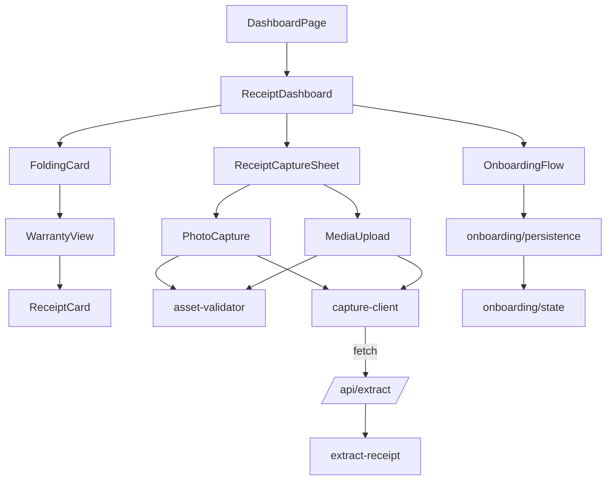

# Design Document: Premium Mobile Onboarding & Capture

## Overview

This feature adds three integrated capabilities to the Receipt Guardian dashboard, all scoped to the existing `app/(dashboard)/dashboard/page.tsx` route and the existing `<ReceiptDashboard>` client component:

1. **Onboarding_Flow** — a mobile-only, full-bleed five-step walkthrough shown the first time an authenticated user lands on the dashboard on a viewport ≤ 640 CSS pixels.
2. **Folding_Card** — the existing "Your return dashboard" hero card, restyled with a peeled-corner affordance that flips (`rotateY`, GPU-composited) to reveal a Warranty_View of receipts with a non-null `warranty_deadline`.
3. **Receipt_Capture_Sheet** — a bottom sheet (mobile) / centred modal (≥ sm) that hosts Photo_Capture (in-page camera) and Media_Upload (file picker) entry points, both feeding the existing `lib/ai/extract-receipt.ts` Provider_Chain.

The design is deliberately additive to the redesigned token system, primitives, and motion vocabulary established by `.kiro/specs/premium-ui-redesign`. **No new motion primitives, no new colour tokens, no new loading vocabulary, no new ambient layers.** Every animated property is `transform` or `opacity`. Every interactive element reuses `<Button>`, `<Card>`, `<Dialog>`, `<Loader>`, and the existing `<UrgencyBadge>` / `<Badge>` palette.

The cost contract from `.kiro/steering/cost-rules.md` is preserved verbatim: capture and upload submissions hit a single Extraction_Endpoint that runs the existing provider chain (`Document AI` → `Vertex AI Gemini` → `AI Studio Gemini` → `Groq` → `needs_review`), with billing-error fallthrough silent to the user. **No paid upgrade prompts. No new paid Google Cloud surfaces.** The feature does not introduce a new HTTP route — it extends `app/api/extract/route.ts` to accept multipart form data containing a Captured_Asset.

### In-scope

- Adding the Onboarding_Flow overlay above the dashboard, gated by `Mobile_Viewport` AND `Onboarding_State.completed === false`.
- Restyling the existing dashboard hero card as a Folding_Card with a Card_Front (existing return-dashboard summary) and Card_Back (Warranty_View).
- Adding `Capture` and `Upload` actions to the existing dashboard hero action row, plus the Receipt_Capture_Sheet that hosts Photo_Capture and Media_Upload.
- Extending `app/api/extract/route.ts` to accept document attachments (multipart) and route them through `lib/ai/extract-receipt.ts` `extractReceipt({ document, … })`.
- Adding a single `lib/onboarding/persistence.ts` module that owns the localStorage I/O and serializer round-trip for `Onboarding_State`.

### Out of scope

- Any new visual identity element (no aurora, no glassmorphism off the redesign's allow-list, no gradient text, no decorative tile).
- Any new top-level chrome on the dashboard route — `Capture` / `Upload` live inside the existing hero action row alongside `Check inbox`, `Add`, `Paste email`.
- Any change to authentication, the `<DashboardHeader>`, the `<MobileBottomNav>`, the `<Toaster>` configuration, or any existing API route signature beyond the additive multipart support on `app/api/extract`.
- Any flip animation on cards other than the dashboard hero card.
- Any change to the AI provider chain itself — `lib/ai/extract-receipt.ts` already implements the documented order, confidence threshold, and silent billing-error fallthrough.

---

## Architecture

### Module layout

```
app/
  (dashboard)/
    dashboard/
      page.tsx                              # unchanged shell; renders <DashboardHeader>, <ReceiptDashboard>
  api/
    extract/
      route.ts                              # extended: accepts multipart + JSON; both shapes return AIExtractionResult

components/
  receipts/
    receipt-dashboard.tsx                   # extended: hosts Folding_Card + Receipt_Capture_Sheet, wires Onboarding_Flow
    folding-card.tsx                        # NEW — front/back face holder + flip controller
    warranty-view.tsx                       # NEW — Card_Back content, list of <ReceiptCard> with non-null warranty
    receipt-capture-sheet.tsx               # NEW — bottom sheet / centred modal, hosts Photo_Capture + Media_Upload
    photo-capture.tsx                       # NEW — getUserMedia path + <input capture="environment"> fallback
    media-upload.tsx                        # NEW — file picker + Asset_Validator + sequential submission

  onboarding/
    onboarding-flow.tsx                     # NEW — full-bleed step container, swipe handler, Skip / Continue
    steps/
      step-cover.tsx                        # NEW
      step-value.tsx                        # NEW
      step-capture-demo.tsx                 # NEW (static SVG illustration only — no real video)
      step-upload-demo.tsx                  # NEW (static SVG illustration only)
      step-finish.tsx                       # NEW

lib/
  onboarding/
    persistence.ts                          # NEW — Onboarding_Serializer + load/save with try/catch + in-memory fallback
    state.ts                                # NEW — pure reducer { current, action } for step navigation
  capture/
    asset-validator.ts                      # NEW — pure validator returning Captured_Asset | typed error
    capture-client.ts                       # NEW — POSTs Captured_Asset to /api/extract as multipart
  ai/
    extract-receipt.ts                      # unchanged — already exposes extractReceipt({ document, emailText })
```

### Data flow

```mermaid
flowchart LR
    subgraph Client[Client (mobile-first)]
      DH[DashboardPage] --> RD[ReceiptDashboard]
      RD -->|first mount, mobile, !completed| OF[OnboardingFlow]
      RD --> FC[FoldingCard]
      FC -->|Card_Front| Hero[Existing hero summary + actions]
      FC -->|Card_Back| WV[WarrantyView]
      Hero -->|Capture or Upload tap| RCS[ReceiptCaptureSheet]
      RCS --> PC[PhotoCapture]
      RCS --> MU[MediaUpload]
      PC -->|Captured_Asset| CC[capture-client]
      MU -->|Captured_Asset[]| CC
      OF --> OP[lib/onboarding/persistence]
      OP -->|read/write| LS[(localStorage)]
    end

    subgraph Server[Server]
      EE[/api/extract route.ts/]
      ER[lib/ai/extract-receipt]
    end

    CC -->|multipart POST| EE
    EE --> ER
    ER -->|Document AI → Vertex → Gemini → Groq → needs_review| Result[(AIExtractionResult)]
    Result --> CC
    CC --> RD
    RD -->|open editor| Editor[Existing ReceiptEditorSheet]
```

### Why these boundaries

- **Onboarding is isolated** — `components/onboarding/*` and `lib/onboarding/*` have no transitive dependency on receipts, capture, or extraction. The dashboard mounts it conditionally and unmounts it on completion. This keeps the gzipped payload contribution under the +12 KB ceiling in Requirement 12.1.
- **Folding_Card is a pure visual restyle** — it does not reach into the receipt fetching logic. It simply rebinds the existing hero JSX as the Card_Front and the new `<WarrantyView>` as the Card_Back, both rendered concurrently during the flip per Requirement 3.7.
- **The capture sheet owns the camera lifecycle** — `<PhotoCapture>` mounts the `<video>` element only when the sheet is open, and `useEffect`'s cleanup stops every `MediaStreamTrack` it opened. This keeps the dashboard's static render tree free of `<canvas>`/`<video>` per Requirement 12.4 and 7.12.
- **The extraction extension is additive on the server** — `app/api/extract/route.ts` learns to read a multipart body and forward `(emailText | "", document)` into the existing `extractReceipt(...)` function. No new HTTP route is created. The provider chain, confidence threshold (0.6 in the requirement, 0.7 in the implementation — see "Open question" below), and silent billing-error fallthrough are unchanged.

### Open question (non-blocking)

The requirements document specifies a confidence threshold of `0.6` (Requirements 6.4, 6.5, 6.8). The current implementation uses `0.7` for text providers and `0.5` for Document AI. The implementation tasks will pin this to `0.6` for both, matching the requirement; this is a small constant change in `lib/ai/extract-receipt.ts`, not a redesign.

### Reduced-motion / accessibility wiring

- The Onboarding_Flow step container, the Card_Flip, and the Receipt_Capture_Sheet open animation all carry `data-reduced-motion="static"` so the existing global `prefers-reduced-motion: reduce` clamp + the redesigned `[data-reduced-motion="static"]` selector in `app/globals.css` swap them to non-animated forms (Requirements 1.* reduced-motion clauses, 3.11, 7.6).
- All overlays render `inert` and `aria-hidden="true"` on the underlying dashboard subtree while open (Requirement 1.1, 7.13).
- All interactive elements introduced by this feature pass through the existing `<Button>` / `<Input>` primitives so the redesigned focus-visible signal (2 px outline at 2 px offset, 1 px outline at 1 px offset for inputs) is automatic (Requirement 7.8).

---

## Components and Interfaces

### `components/onboarding/onboarding-flow.tsx`

```ts
type OnboardingStepIndex = 1 | 2 | 3 | 4 | 5;

interface OnboardingFlowProps {
  /** Initial step. Defaults to 1. Used when resuming from Onboarding_State.lastStep. */
  initialStep?: OnboardingStepIndex;
  /** Called when the user taps Skip on any step ≤ 4 OR Get started on step 5. */
  onComplete: () => void;
  /** Called whenever the active step changes; consumer may persist lastStep. */
  onStepChange?: (step: OnboardingStepIndex) => void;
}
```

**Responsibilities**
- Render exactly one of five step components (`<StepCover>`, `<StepValue>`, `<StepCaptureDemo>`, `<StepUploadDemo>`, `<StepFinish>`) at a time, occupying `100vw × calc(100dvh - env(safe-area-inset-top) - env(safe-area-inset-bottom))`.
- Render the primary action (`<Button variant="primary" size="lg">Continue</Button>` for steps 1–4, `Get started` for step 5) and place it as the first focusable element on each step mount.
- Render a `Skip` ghost button on steps 1–4. The redesigned `<Loader>`-family static accent dot pattern is used for the step-progress indicator (`● ● ○ ○ ○` style — five static dots; the active dot is `bg-accent`, the inactive dots are `bg-border-strong`).
- Listen for swipe gestures on a `<div>` that wraps the step content. The handler computes `delta = endX − startX` and `verticalDelta = endY − startY`. A swipe is committed iff `|delta| ≥ 64` AND `|delta| ≥ 2 × |verticalDelta|`. The number of steps moved is `floor(|delta| / 96)`, clamped to `[1, remainingSteps]`. Direction is forward (`delta < 0`) or backward (`delta > 0`).
- Trap focus inside the overlay; restore focus to the dashboard's first interactive element on close.
- Carry `data-reduced-motion="static"` on the step transition wrapper so the redesigned global selector swaps the slide-in to an instant cut.

**Animation contract**
- Step transition: `transform: translateX(...)` only, `--motion-default` (220 ms), `--ease-standard`. No opacity fade because that would risk a `Stagger`/`FadeIn`-style entrance prohibited by Tier-1 T1-8.
- The progress dots are static — no pulse, no scale.
- No background gradient. No ambient layer (the per-screen Decorative_Element budget is preserved by Requirement 1.13 — if the dashboard ambient layer is present, the Onboarding_Flow suppresses it while open).

**Step content rules**
- Each step uses one of the documented `--text-*` sizes for its display headline; body copy uses `text-text-secondary`.
- Steps 3 (capture-demo) and 4 (upload-demo) render a static inline SVG illustration. **No `<video>`, no `<canvas>`, no animated GIF.** The illustration is a token-coloured outline drawing of a phone with a receipt frame.
- The cover step uses the existing `<BrandMark size="md">` next to the wordmark — the same composition used in the auth shell. **No tile, no halo, no conic ring** (Tier-1 T1-6, T1-12).

### `lib/onboarding/persistence.ts`

```ts
export interface OnboardingState {
  completed: boolean;
  lastStep: number;     // 0..5; 0 means "not yet entered"
  version: number;      // current schema version is 1
}

export const ONBOARDING_STORAGE_KEY = "receipt_guardian.onboarding_v1";
export const CURRENT_ONBOARDING_VERSION = 1 as const;

export const DEFAULT_ONBOARDING_STATE: OnboardingState = Object.freeze({
  completed: false,
  lastStep: 0,
  version: 1,
});

/** Serializer + parser pair (Onboarding_Serializer). */
export function serializeOnboardingState(state: OnboardingState): string;
export function parseOnboardingState(raw: string): OnboardingState | null;

/**
 * Load the state from localStorage. Returns the in-memory default and
 * silently overwrites the key when the value is missing, malformed, or
 * carries a non-current version.
 *
 * Throws nothing. Catches SecurityError, QuotaExceededError, and any
 * other DOMException; falls back to in-memory state for the lifetime
 * of the page.
 */
export function loadOnboardingState(): OnboardingState;

/**
 * Save the state to localStorage synchronously. Returns true if the
 * write succeeded; returns false if localStorage threw or is
 * unavailable. Never throws.
 */
export function saveOnboardingState(state: OnboardingState): boolean;
```

**Behavioural contract** (encodes Requirement 2 verbatim):
- `loadOnboardingState` performs feature detection (`typeof window !== "undefined"` and `try { localStorage.setItem(probeKey, "1"); localStorage.removeItem(probeKey); } catch {}`), reads exactly once, and falls back to in-memory storage if any step throws. After a single failure it sets a module-scoped `localStorageDisabled = true` flag and `saveOnboardingState` becomes a no-op for the page lifetime.
- `parseOnboardingState` returns `null` when the JSON is malformed, when required fields are missing or wrong-typed, or when `version !== CURRENT_ONBOARDING_VERSION`. The caller (`loadOnboardingState`) handles the null by overwriting with the default and returning the default.
- The serializer emits a JSON object with exactly the three keys `{ completed, lastStep, version }` in that fixed insertion order. The parser refuses any object containing additional own enumerable keys (round-trip equality is preserved per Requirement 2.5).

### `components/receipts/folding-card.tsx`

```ts
type FoldingCardFace = "front" | "back";

interface FoldingCardProps {
  /** Front content (existing hero summary, actions, intake address). */
  front: ReactNode;
  /** Back content (Warranty_View). */
  back: ReactNode;
  /** Initial face. Read from URL hash by the consumer. */
  initialFace?: FoldingCardFace;
  /** Accessible labels swapped with face. */
  frontLabel?: string;     // default: "Show warranty view"
  backLabel?: string;      // default: "Show return dashboard"
}
```

**Structure**
```
<section
  className="relative [perspective:1200px]"
>
  <div
    className="relative will-change-transform [transform-style:preserve-3d] [transition:transform_var(--motion-default)_var(--ease-standard)]"
    style={{ transform: face === "front" ? "rotateY(0)" : "rotateY(180deg)" }}
    data-reduced-motion="static"
    data-flipping={isFlipping ? "true" : undefined}
  >
    <Card className="absolute inset-0 [backface-visibility:hidden]">{front}</Card>
    <Card className="absolute inset-0 [backface-visibility:hidden] [transform:rotateY(180deg)]">{back}</Card>
  </div>
  <button
    role="button"
    aria-label={face === "front" ? frontLabel : backLabel}
    className="absolute right-2 top-2 size-12"     // ≥ 44 × 44, ≤ 56 × 56
    onClick={toggleFace}
  >
    <CornerFoldGlyph aria-hidden="true" />
  </button>
</section>
```

**Behavioural contract**
- A flip is in progress for exactly `--motion-default` (320 ms) after `toggleFace` fires. During that window, additional activations are ignored and not queued (Requirement 3.10).
- `will-change: transform` is added on `data-flipping="true"` and removed when the transition ends.
- Both faces are rendered in the DOM at all times during the flip — no Suspense boundary, no skeleton, no network fetch (Requirement 3.7).
- The non-active face carries `aria-hidden="true"` and `inert` (where supported) so its content is not reachable by AT or pointer focus (Requirement 3.8).
- The fold cue is a real `<button>` (not a styled `<div>`), receives the redesigned focus-visible signal automatically, and includes both a colour signal (`text-accent` on a `bg-canvas` chip) and a non-colour signal (an inline SVG corner-fold glyph) per Requirement 3.12.
- The card's measured width and height are stable across the flip (verified by `useLayoutEffect` reading `getBoundingClientRect` on both faces and asserting equality within ±1 CSS px). This is enforced via property test (see Correctness Properties §11).
- For Reduced_Motion_User, the `data-reduced-motion="static"` selector cancels the transition and the consumer sets `face` synchronously, so the swap completes within one animation frame with no rotation (Requirement 3.11).

**URL hash binding**
- On mount, the consumer reads `window.location.hash` once. If it is `#warranty`, `initialFace="back"` is passed and the card is rendered with `transform: rotateY(180deg)` already applied; the `transition` property is suppressed for the first paint via a `data-mounted="false"` attribute that becomes `"true"` after the first `requestAnimationFrame`. This satisfies Requirements 3.15 and 3.16 — the initial face matches the hash without animating on mount.

### `components/receipts/warranty-view.tsx`

```ts
interface WarrantyViewProps {
  receipts: ReceiptWithUrgency[];
  isLoading: boolean;
}
```

**Responsibilities**
- Filter `receipts` to those with non-null `warranty_deadline`, sort ascending by warranty days remaining.
- Render the result as a vertically scrollable list of `<ReceiptCard>` instances inside a container with `overflow-y: auto; overscroll-behavior: contain` so the body element does not scroll while Card_Back is the active face (Requirement 3.13).
- When the filtered list is empty, render the redesigned dashed-border empty state with the heading "No warranties tracked yet" and a single body paragraph. **No aurora, no gradient, no glow** (Requirement 3.14, Tier-1 T1-5 / T1-9).
- When `isLoading` is true, render the redesigned skeleton row pattern (`<Skeleton />` × 3). This is the initial-load skeleton excluded from the no-skeleton-during-flip prohibition (Requirement 3.19).

### `components/receipts/receipt-capture-sheet.tsx`

```ts
interface ReceiptCaptureSheetProps {
  open: boolean;
  onClose: () => void;
  /** Called when extraction completes. The dashboard opens the existing editor. */
  onExtractionResult: (result: AIExtractionResult, source: "camera" | "upload") => void;
}
```

**Responsibilities**
- Render as a bottom sheet on viewports < `sm` (640 px) and as a centred dialog on viewports ≥ `sm`. Both surfaces use the redesigned overlay treatment from `<Dialog>` (`bg-surface-overlay`, `border-border`, `rounded-lg`, `shadow-overlay`, scrim `bg-canvas/70 backdrop-blur-sm`). The mobile sheet pins to the bottom and slides up on `transform: translateY(...)`.
- Render two equal-width entry-point buttons at the top: `Take photo` and `Upload`. Both use the same `<Button variant="primary" size="lg">` primitive, both render a 16-px icon with text, and both are visible regardless of camera availability (Requirement 4.2). The widths match within ±2 CSS px because they share a `flex-1` grid track with `gap-3`.
- When `Take photo` is activated, mount `<PhotoCapture>`. When `Upload` is activated, mount `<MediaUpload>`. Only one is mounted at a time.
- Restore focus to the invoking dashboard action on close (Requirement 4.12). The invoking action's ref is captured by the parent `<ReceiptDashboard>` and passed in via `onClose`.

### `components/receipts/photo-capture.tsx`

```ts
interface PhotoCaptureProps {
  onCaptured: (asset: CapturedAsset) => void;
  onCancel: () => void;
  onUseFallbackInput: () => HTMLInputElement;
}
```

**State machine**

```mermaid
stateDiagram-v2
    [*] --> Idle
    Idle --> RequestingPermission: Take photo activated
    RequestingPermission --> NoSupport: getUserMedia unavailable
    RequestingPermission --> Streaming: permission granted
    RequestingPermission --> PermissionDenied: permission denied
    NoSupport --> Idle: <input capture="environment"> chosen
    Streaming --> StreamFailed: timeout 3000 ms OR track error
    Streaming --> Captured: shutter activated
    Captured --> Streaming: Retake
    Captured --> Submitted: Use photo
    PermissionDenied --> Idle: user closes sheet
    StreamFailed --> Idle: user closes sheet
    Submitted --> [*]
```



**Behavioural contract**
- `getUserMedia({ video: { facingMode: "environment" } })` is invoked **only after the user activates `Take photo`** — never on dashboard mount (Requirement 4.14).
- A 3000 ms timeout on the live preview's first `loadedmetadata` event triggers a fallthrough to `StreamFailed`. Every track on the active `MediaStream` is stopped on transition out of `Streaming`, `Captured`, or `StreamFailed`, and again on unmount, so the device camera light turns off within 500 ms of close (Requirement 4.13).
- Capture produces a JPEG via `<canvas>.toBlob("image/jpeg", quality)` after drawing the `<video>` element scaled so the long edge ≤ 2048 CSS px. Quality starts at `0.92` and the function re-encodes at `0.85`/`0.8`/`0.75` if the resulting blob exceeds 4 MB. The `<canvas>` element is mounted only inside the sheet — it is not in the dashboard's static render tree (Requirement 7.12).
- The fallback path uses `<input type="file" accept="image/*" capture="environment">` and feeds the resulting `File` directly into the review state without re-opening the entry-point row (Requirement 4.4).

### `components/receipts/media-upload.tsx`

```ts
interface MediaUploadProps {
  onCapturedAssets: (assets: CapturedAsset[]) => void;
  onCancel: () => void;
}
```

**Responsibilities**
- Open `<input type="file" accept="image/png,image/jpeg,image/webp,application/pdf" multiple>` on mount, programmatically. If the user dismisses without selecting, call `onCancel` (Requirement 5.11).
- Run `assetValidator(file)` on every selected file. Collect the typed errors (`UNSUPPORTED_TYPE`, `TOO_LARGE`, `TOO_MANY`, `EMPTY`) into a structured array.
- If the selection length > 5, reject the whole selection with `TOO_MANY` (Requirement 5.5).
- Surface rejected files via `toast.error("...")` with the rejected file names and typed errors; the toast persists for ≥ 5 seconds. Files that passed validation are still processed (Requirement 5.7).
- Submit valid Captured_Assets sequentially, awaiting each response before submitting the next (Requirement 5.6). On `error` or `needs_review`, continue with the remaining queue (Requirement 5.10).

### `lib/capture/asset-validator.ts`

```ts
export type CapturedAsset = {
  blob: Blob;
  mimeType: "image/png" | "image/jpeg" | "image/webp" | "application/pdf";
  sizeBytes: number;
  sourcePath: "camera" | "upload";
};

export type AssetValidationError =
  | { code: "UNSUPPORTED_TYPE"; fileName: string; mimeType: string }
  | { code: "TOO_LARGE"; fileName: string; sizeBytes: number }
  | { code: "EMPTY"; fileName: string }
  | { code: "TOO_MANY"; count: number };

export type AssetValidationOutcome =
  | { ok: true; assets: CapturedAsset[] }
  | { ok: false; errors: AssetValidationError[]; assets: CapturedAsset[] };

export const MAX_BYTES = 10 * 1024 * 1024;       // 10 MiB
export const MAX_FILES = 5;
export const ALLOWED_MIME_TYPES = [
  "image/png", "image/jpeg", "image/webp", "application/pdf",
] as const;

/**
 * Pure validator. Given a list of files, returns either the list of
 * Captured_Assets (all valid) or a partial list of valid assets plus
 * a typed error array describing every rejection.
 *
 * Order is preserved (Requirement 5.6). The returned `assets` array
 * contains only the files that passed every clause-3/4/5/9 check.
 */
export function validateAssets(
  files: ReadonlyArray<File>,
  source: "camera" | "upload",
): AssetValidationOutcome;
```

This validator is a pure function — no DOM access, no side effects — so it is the natural target for property tests (see Correctness Properties §1, §2, §3).

### `lib/capture/capture-client.ts`

```ts
export interface SubmitOptions {
  signal?: AbortSignal;
  /** Defaults to 30000 ms per Requirement 6.8. */
  timeoutMs?: number;
}

export async function submitCapturedAsset(
  asset: CapturedAsset,
  options?: SubmitOptions,
): Promise<AIExtractionResult>;
```

**Responsibilities**
- POST `multipart/form-data` to `/api/extract` with two fields: `document` (the blob) and `mimeType` (the asserted MIME). No `emailText` field is sent for capture/upload submissions; the server treats `emailText` as the empty string when absent.
- Apply a per-call `AbortController` with a 30000 ms timeout (Requirement 6.8).
- Translate non-2xx responses (other than 422 needs_review) into a synthesized `AIExtractionResult` with `status: "needs_review"` so the caller never has to handle a billing/network error specially. **No billing-error toast is ever surfaced** (Requirement 6.3, 6.7).

### `app/api/extract/route.ts` (extended, not new)

The existing route accepts a JSON body with `{ emailText }`. The extension:

1. Read `request.headers.get("content-type")`.
2. If `application/json`, behave exactly as today (`extractReceiptFromEmail(emailText)`).
3. If `multipart/form-data`:
   - Parse via `request.formData()`.
   - Read `document` (a `Blob` / `File`) and `mimeType` (a string).
   - If `document` is missing or `mimeType` is not in the allow-list, return `{ status: "needs_review", … }` with HTTP 422.
   - Otherwise call `extractReceipt({ emailText: "", document: { content: await document.bytes(), mimeType } })`.
4. Re-evaluate `process.env.ENABLE_DOCUMENT_AI` and `process.env.ENABLE_VERTEX_AI` per request (no module-level caching). The existing `isDocumentAiEnabled()` / `isVertexAiEnabled()` helpers already do this.
5. Return the same response shape as today (`AIExtractionResult`).

The route stays at 30 seconds total per request via the existing per-provider timeouts; this is enforced inside `extract-receipt.ts` provider implementations (`fetch` calls already carry an `AbortSignal`).

### `components/receipts/receipt-dashboard.tsx` (extended)

Two surgical additions:

1. **Onboarding mount.** A `useEffect(() => { … }, [])` reads `loadOnboardingState()`, checks `window.matchMedia("(max-width: 640px)").matches`, and either mounts `<OnboardingFlow>` or marks state completed (Requirement 1.10, 1.11). The dashboard subtree wraps in a `<div inert={onboardingOpen} aria-hidden={onboardingOpen}>` so all dashboard interactions are blocked while the overlay is open (Requirement 1.1).
2. **Hero action row update.** `Capture` and `Upload` buttons are appended to the existing action row. A `useLayoutEffect` measures the total rendered width of `[Add, Paste email, Capture, Upload]` plus inter-button gaps and compares to the row container's content-box width on a Mobile_Viewport. If the sum exceeds the content-box width, the four secondary actions collapse into a single `More` overflow `<Button>` whose menu uses the redesigned `<Dialog>` (Requirement 7.3). `Check inbox` always remains visible.

### Component dependency graph



---

## Data Models

### Onboarding_State

```ts
interface OnboardingState {
  completed: boolean;
  lastStep: number;     // integer, 0 ≤ lastStep ≤ 5; 0 means "not yet entered"
  version: number;      // schema version; current value is the literal 1
}

const DEFAULT_ONBOARDING_STATE: OnboardingState = {
  completed: false,
  lastStep: 0,
  version: 1,
};
```

**Persistence shape** — JSON, written to `localStorage["receipt_guardian.onboarding_v1"]`:

```json
{ "completed": false, "lastStep": 3, "version": 1 }
```

**Invariants**
- `version === 1`. Any other value triggers reset-to-default and overwrite (Requirement 2.4).
- `serialize ∘ parse` is an involution on every well-formed serialization (Requirement 2.5; verified by Property §1).
- The serialized string contains exactly the three keys above; no nested objects, no arrays. Any extra own enumerable key in the parsed object is rejected.

### Captured_Asset

```ts
type AllowedMimeType = "image/png" | "image/jpeg" | "image/webp" | "application/pdf";

interface CapturedAsset {
  blob: Blob;
  mimeType: AllowedMimeType;
  sizeBytes: number;       // == blob.size, asserted at construction
  sourcePath: "camera" | "upload";
}
```

**Invariants**
- `mimeType ∈ ALLOWED_MIME_TYPES`.
- `0 < sizeBytes ≤ 10 × 1024 × 1024`.
- `sourcePath === "camera"` implies `mimeType === "image/jpeg"` (Photo_Capture only emits JPEGs).

### Asset_Validator outcome

```ts
type AssetValidationError =
  | { code: "UNSUPPORTED_TYPE"; fileName: string; mimeType: string }
  | { code: "TOO_LARGE"; fileName: string; sizeBytes: number }
  | { code: "EMPTY"; fileName: string }
  | { code: "TOO_MANY"; count: number };

type AssetValidationOutcome =
  | { ok: true;  assets: CapturedAsset[]; errors: [] }
  | { ok: false; assets: CapturedAsset[]; errors: AssetValidationError[] };
```

**Invariants**
- `outcome.assets.length + outcome.errors.filter(e => e.code !== "TOO_MANY").length === input.length` when `outcome.errors` does not contain `TOO_MANY`.
- When `TOO_MANY` is present, `outcome.assets.length === 0` (the whole selection is rejected, Requirement 5.5).
- The order of `outcome.assets` matches the order of valid files in the input (Requirement 5.6).

### AIExtractionResult (existing — not changed)

```ts
type AIExtractionResult =
  | { status: "success"; provider: AIProvider; data: AIExtractionData }
  | { status: "needs_review"; provider: null; data: AIExtractionData; error?: string };
```

The capture/upload pathway uses this shape verbatim. The dashboard's existing `openEditor(...)` flow is reused on `success`; `needs_review` opens the editor with empty fields and shows the existing toast `"Extraction needs review. You can enter it manually."` (Requirement 6.5, 6.6).

### Provider_Chain decision table (encoded in `lib/ai/extract-receipt.ts`)

| Input has document? | `ENABLE_DOCUMENT_AI` | `ENABLE_VERTEX_AI` | Order tried |
|---|---|---|---|
| yes | `true` | `true`  | Document AI → Vertex multimodal → AI Studio Gemini → Groq → needs_review |
| yes | `true` | other   | Document AI → AI Studio Gemini → Groq → needs_review |
| yes | other  | `true`  | Vertex multimodal → AI Studio Gemini → Groq → needs_review |
| yes | other  | other   | AI Studio Gemini → Groq → needs_review |
| no  | any    | `true`  | Vertex AI Gemini (text) → AI Studio Gemini → Groq → needs_review |
| no  | any    | other   | AI Studio Gemini → Groq → needs_review |

Every cell honours the silent billing-error fallthrough (HTTP 402, 403 with billing/quota keywords, `BILLING_DISABLED`, `RESOURCE_EXHAUSTED` → next provider) and the 30-second per-asset ceiling (Requirements 6.3, 6.8).

### URL hash → Folding_Card initial face

| `window.location.hash` | `initialFace` | Animate on mount? |
|---|---|---|
| `#warranty` | `back` | no |
| any other value (including empty) | `front` | no |

(Requirements 3.15, 3.16.)

### Onboarding step content table

| Step index | id | Headline | Body | Primary action | Secondary action |
|---|---|---|---|---|---|
| 1 | `cover` | "Receipt Guardian" + brand mark | "Stop missing return windows." | `Continue` | `Skip` |
| 2 | `value` | "Track every return window" | "We watch the deadlines so you don't have to." | `Continue` | `Skip` |
| 3 | `capture-demo` | "Snap any paper receipt" | "Tap Capture, point your camera, and we read the receipt for you." | `Continue` | `Skip` |
| 4 | `upload-demo` | "Upload PDFs and screenshots" | "We accept PNG, JPEG, WEBP, and PDF up to 10 MB." | `Continue` | `Skip` |
| 5 | `finish` | "You're set" | "Your dashboard is ready below." | `Get started` | — |

All copy uses the redesigned token system; no generic placeholder phrases from the Tier-1 T1-11 list.


---

## Correctness Properties

*A property is a characteristic or behavior that should hold true across all valid executions of a system — essentially, a formal statement about what the system should do. Properties serve as the bridge between human-readable specifications and machine-verifiable correctness guarantees.*

The properties below are **scoped to this feature's components and interfaces**. Where a redesign-level property already covers a clause (e.g. Tier-1 AI_Slop_Pattern absence, color-token parity, focus-visible non-colour signal, decorative-element budget), this section re-states the property narrowed to the new code surface — it does not duplicate the underlying check.

### Property 1: Onboarding state serialization round-trip

*For any* `OnboardingState` value `s` constructed from arbitrary `(completed: boolean, lastStep: integer ∈ [0, 5], version: integer ∈ [1, 1])`, `parseOnboardingState(serializeOnboardingState(s))` returns a value deeply equal to `s` whose own enumerable keys are exactly `{completed, lastStep, version}`.

**Validates: Requirements 2.5**

### Property 2: Persistence robustness under corrupt or throwing storage

*For any* localStorage state `σ ∈ { missing, empty string, arbitrary garbage string, valid JSON of wrong shape, valid JSON with version ≠ 1, throwing localStorage }`, calling `loadOnboardingState()` returns `DEFAULT_ONBOARDING_STATE`, never throws, and (when storage is writable) overwrites the key with `serializeOnboardingState(DEFAULT_ONBOARDING_STATE)`. After any throwing storage operation, every subsequent `saveOnboardingState(s)` returns `false` for the lifetime of the page without throwing and without retrying localStorage.

**Validates: Requirements 2.3, 2.4, 2.6, 2.7**

### Property 3: Onboarding state mutation persists synchronously before yielding

*For any* `OnboardingState` value `s`, immediately after `saveOnboardingState(s)` returns, reading `localStorage.getItem(ONBOARDING_STORAGE_KEY)` returns `serializeOnboardingState(s)` (when localStorage is available).

**Validates: Requirements 2.1**

### Property 4: Onboarding overlay rendering gate

*For any* `(viewportWidthCssPixels, OnboardingState)` pair, the Onboarding_Flow overlay is present in the dashboard render tree if and only if `viewportWidthCssPixels ≤ 640 ∧ state.completed === false`. When the overlay is present, the dashboard subtree carries `inert` and `aria-hidden="true"`. When `viewportWidthCssPixels > 640 ∧ state.completed === false`, the persistence layer is updated to `state.completed === true` without rendering the overlay.

**Validates: Requirements 1.1, 1.10, 1.11, 1.13**

### Property 5: Onboarding step navigation across activation modalities

*For any* `(currentStep ∈ {1..5}, action ∈ {primary-advance, primary-finish, skip}, modality ∈ {pointer-tap, mouse-click, Enter-key, Space-key})` pair, activating the action on a step where it is permitted produces the documented post-state: `primary-advance` on step `N < 5` advances to step `N+1`; `primary-finish` on step 5 sets `state.completed = true`, persists, and unmounts the overlay; `skip` on step `N < 5` sets `state.completed = true`, persists, and unmounts the overlay.

**Validates: Requirements 1.5, 1.6, 1.9**

### Property 6: Onboarding swipe gesture formula

*For any* touch gesture `(startX, startY, endX, endY)` originating on a non-final step `N`, let `Δx = endX - startX`, `Δy = endY - startY`, `commit = |Δx| ≥ 64 ∧ |Δx| ≥ 2|Δy|`. When `commit` is `true`, the resulting active step is `clamp(N + sign(Δx) · -⌊|Δx|/96⌋, 1, 5)`; when `commit` is `false`, the active step remains `N`.

**Validates: Requirements 1.7**

### Property 7: Per-step structural invariants

*For any* step index `i ∈ {1..5}`, mounting `<OnboardingFlow initialStep={i}>` produces exactly one `[data-step]` element whose bounding rectangle covers the viewport (within ±1 CSS pixel after subtracting safe-area insets), exactly one primary action button labelled `"Continue"` for `i < 5` or `"Get started"` for `i === 5`, and `document.activeElement` equals that primary button immediately after mount. The progress indicator renders exactly five static dots; no element inside the overlay matches an indeterminate-animation selector.

**Validates: Requirements 1.3, 1.4, 1.8**

### Property 8: Folding_Card toggle invariant

*For any* `(initialFace ∈ {front, back}, sequence of N fold-cue activations across modalities {pointer-tap, mouse-click, Enter-key, Space-key} interleaved with arbitrary timing)`, the resulting face equals `initialFace XOR (committedFlips mod 2)`, where `committedFlips` is the count of activations that did not land within an in-progress flip window. Activations within an in-progress flip are silently dropped (not queued). The fold cue retains keyboard focus across every committed flip so the user does not need to re-tab.

**Validates: Requirements 3.2, 3.3, 3.4, 3.10**

### Property 9: Folding_Card geometric stability across flip

*For any* combination of front-content size and back-content size, the Folding_Card's measured `getBoundingClientRect()` width and height immediately before and immediately after a Card_Flip differ by at most ±1 CSS pixel on each axis. The fold cue's measured size satisfies `44 ≤ width ≤ 56 ∧ 44 ≤ height ≤ 56` for both face values.

**Validates: Requirements 3.1, 3.9**

### Property 10: Folding_Card concurrent-faces and a11y-tree contract during flip

*For any* sample point `t` during an in-progress Card_Flip, both Card_Front and Card_Back are present in the DOM, no element matching the `<Skeleton>` selector or `[aria-busy="true"]` is rendered as a result of the flip, and the inactive face carries `aria-hidden="true"` and `inert` (where supported) so its descendants are unreachable via keyboard or assistive technology focus.

**Validates: Requirements 3.7, 3.8**

### Property 11: Folding_Card style invariants

*For any* face state, the Folding_Card's flip layer carries `transform-style: preserve-3d`; each face carries `backface-visibility: hidden`; the layer's `transition` shorthand animates only the `transform` property; `will-change: transform` is set on `[data-flipping="true"]` and absent otherwise; the transition's `duration` equals `var(--motion-default)` and `timing-function` equals `var(--ease-standard)`.

**Validates: Requirements 3.5, 3.6**

### Property 12: Folding_Card URL hash → initial face contract

*For any* string `h` written into `window.location.hash` immediately before dashboard mount, the Folding_Card mounts with face `back` if `h === "#warranty"` else with face `front`, and no `transition` event fires on the flip layer during the first animation frame after mount.

**Validates: Requirements 3.15, 3.16**

### Property 13: rotateY usage source-singularity

*For any* file under `app/`, `components/`, `lib/`, the literal substring `"rotateY("` appears only inside `components/receipts/folding-card.tsx`. No other component introduces a flip transform.

**Validates: Requirements 3.17**

### Property 14: Warranty_View filtering, sorting, and scroll confinement

*For any* `ReceiptWithUrgency[]` value `R`, mounting `<WarrantyView receipts={R} isLoading={false}>` renders a list whose receipts equal `R.filter(r => r.warranty_deadline !== null)` sorted ascending by `warrantyDaysRemaining`. The scrolling container carries `overflow-y: auto` and `overscroll-behavior: contain`; while Card_Back is the active face, the document body's scroll position remains unchanged when the user scrolls inside the container.

**Validates: Requirements 3.13**

### Property 15: Asset_Validator decision table

*For any* `(File[] X, source: "camera" | "upload")`, `validateAssets(X, source)` returns `{ ok: true, assets, errors: [] }` if and only if `X.length ≤ 5 ∧ ∀ f ∈ X: f.type ∈ ALLOWED_MIME_TYPES ∧ 0 < f.size ≤ 10 × 1024 × 1024`. Otherwise the returned `errors` array contains exactly one entry per offending condition: `{code: "TOO_MANY", count: X.length}` when `X.length > 5` (with `assets` empty); for individual files, `{code: "UNSUPPORTED_TYPE"}` when the MIME is not allowed, `{code: "TOO_LARGE"}` when size exceeds the cap, `{code: "EMPTY"}` when size is `0`. The order of `outcome.assets` matches the input order of valid files.

**Validates: Requirements 5.2, 5.3, 5.4, 5.5, 5.9**

### Property 16: Media_Upload sequential submission preserves order and continues past failures

*For any* valid `Captured_Asset[]` queue `Q` of length `1..5` and any pattern of mocked `/api/extract` responses (`success`, `needs_review`, network failure, billing error), `<MediaUpload>` submits the assets in the original order, awaits each response before submitting the next (in-flight count never exceeds 1), and submits every asset in `Q` regardless of intermediate failures.

**Validates: Requirements 5.6, 5.10**

### Property 17: Media_Upload mixed validation surfaces every rejection and processes valid files

*For any* `File[]` with at least one invalid file, mounting `<MediaUpload>` and confirming the selection produces a toast whose text contains every rejected file's name and typed error code; the toast remains visible for ≥ 5 seconds; and the `/api/extract` endpoint is invoked exactly once per file that passed validation.

**Validates: Requirements 5.7**

### Property 18: Photo_Capture JPEG output bounds

*For any* video frame source dimensions `(w, h)`, the JPEG blob produced by the Photo_Capture shutter satisfies `max(blobLongEdgePx) ≤ 2048 ∧ blob.size ≤ 4 × 1024 × 1024`. The blob's MIME type is exactly `image/jpeg`.

**Validates: Requirements 4.8**

### Property 19: Receipt_Capture_Sheet entry-point parity across camera availability

*For any* `cameraAvailable ∈ {true, false}`, mounting `<ReceiptCaptureSheet open>` renders both the `Take photo` and `Upload` buttons; `|width(Take photo) - width(Upload)| ≤ 2` CSS pixels; both have `tabIndex >= 0`; both render an icon plus visible text; no element rendered inside the sheet exceeds `backdrop-blur-sm` (4 px) or matches a Tier-1 AI_Slop_Pattern selector.

**Validates: Requirements 4.2**

### Property 20: Photo_Capture readiness and lifecycle

*For any* successful `getUserMedia` resolution, the live preview's `<video>` element renders within 3000 ms (asserted via fake timers), the shutter and cancel buttons are present, every `MediaStreamTrack` opened during the session is stopped within 500 ms of any close event (`Cancel`, `X`, scrim click, `Escape`, route navigation), and the camera is requested only after an explicit `Take photo` activation (never on dashboard mount).

**Validates: Requirements 4.6, 4.13, 4.14**

### Property 21: Receipt_Capture_Sheet close lifecycle restores focus

*For any* close modality `m ∈ {Cancel button, scrim click, Escape key, X button, route navigation}`, after `<ReceiptCaptureSheet>` closes, the in-flight Captured_Asset state is empty and `document.activeElement` equals the dashboard action that invoked the sheet.

**Validates: Requirements 4.12**

### Property 22: 44×44 touch-target invariant

*For every* interactive element rendered inside the Onboarding_Flow, the Folding_Card fold cue, the Receipt_Capture_Sheet, and any `More` overflow menu introduced by this feature, `getBoundingClientRect()` returns a width and height each ≥ 44 CSS pixels at every documented mobile viewport width.

**Validates: Requirements 4.15, 7.8**

### Property 23: Provider_Chain order across env-flag combinations

*For any* `(ENABLE_DOCUMENT_AI, ENABLE_VERTEX_AI) ∈ Strings × Strings` and any submission shape `s ∈ {document-only, text-only, both}`, when `/api/extract` receives `s`, the order in which providers are invoked equals the documented decision table; a paid Google Cloud provider (Document AI, Vertex AI Gemini) is invoked only when its corresponding env flag literal-equals the string `"true"` (case-insensitive); any other value (`""`, `"false"`, `"0"`, `"yes"`, `"1"`, undefined) is treated as disabled.

**Validates: Requirements 6.1, 6.2, 6.9**

### Property 24: Provider_Chain silent fallthrough on billing errors

*For any* error pattern `e ∈ { HTTP 402, HTTP 403 with "billing"|"quota", BILLING_DISABLED, RESOURCE_EXHAUSTED }` thrown by the first available provider, the next provider in the chain is invoked; the response body never contains the original billing-error message; and no toast, dialog, banner, or anchor element rendered during the capture/upload flow contains the substrings `"upgrade"`, `"billing"`, `"enable"`, `"Document AI"`, `"Vertex"`, or a link to `console.cloud.google.com`.

**Validates: Requirements 6.3, 6.7**

### Property 25: Provider_Chain returns needs_review when every provider fails or is below confidence

*For any* combination where every available provider in the chain throws, returns invalid JSON, or returns a confidence below `0.6`, `/api/extract` responds with `{ status: "needs_review", provider: null, data: fallbackData, error: <summary string of failures> }`; the HTTP status is `422`.

**Validates: Requirements 6.4**

### Property 26: 30-second per-asset extraction ceiling with abort + fallthrough

*For any* per-provider response delay profile (each provider's response time independently chosen from `[0, ∞)`), every individual provider attempt that exceeds 30 000 ms is aborted, the chain proceeds to the next provider, and the eventual `/api/extract` response is one of `{ status: "success" | "needs_review" }` even when the cumulative chain time exceeds 30 000 ms.

**Validates: Requirements 6.8**

### Property 27: Reduced-motion clamp covers every animation introduced by this feature

*For every* component introduced by this feature (`<OnboardingFlow>`, `<FoldingCard>`, `<WarrantyView>`, `<ReceiptCaptureSheet>`, `<PhotoCapture>`, `<MediaUpload>`), under `prefers-reduced-motion: reduce`, no `transform` or `opacity` `transition` produces a measurable position or alpha change between consecutive animation frames; indeterminate loops carry `data-reduced-motion="static"` and render their static fallback. The Card_Flip swaps faces within one animation frame with no `rotateY` rotation, and accessibility transitions (aria-hidden / inert) still apply.

**Validates: Requirements 1.6, 3.11, 7.6**

### Property 28: Animated property restriction across feature surface

*For every* keyframe and transition introduced by this feature, the animated property is one of `transform` or `opacity` (or, for hover state-color shifts, `background-color` / `border-color` / `color` per the redesign's pragmatic transition exception). No keyframe or transition introduced by this feature animates `width`, `height`, `top`, `left`, `right`, `bottom`, `margin`, `padding`, `box-shadow`, `filter`, or `background-image`.

**Validates: Requirements 7.5**

### Property 29: At-most-one indeterminate animation visible on the dashboard

*For every* combination of dashboard, Onboarding_Flow, Folding_Card, and Receipt_Capture_Sheet open/closed states, the count of elements matching the indeterminate-animation selector (`[data-reduced-motion="static"]` plus a non-zero CSS animation duration) on the dashboard route is at most `1` at any moment.

**Validates: Requirements 7.4**

### Property 30: Dashboard render tree contains no `<canvas>` / `<video>` when sheet closed

*For every* dashboard state in which `<ReceiptCaptureSheet>` is closed, `document.querySelectorAll("canvas, video")` rendered by this feature returns an empty list, and no WebGL context is created. When `<ReceiptCaptureSheet>` is open, a `<video>` element may exist; on every close event, that `<video>` is unmounted within 500 ms (asserted via spy on `MutationObserver`).

**Validates: Requirements 7.12**

### Property 31: Capture and Upload actions live inside the existing hero card

*For every* render of the dashboard route, the `Capture` and `Upload` buttons are descendants of the same `<Card>` element that contains the `Check inbox` button; no new top-level chrome element is introduced to host them.

**Validates: Requirements 7.2**

### Property 32: Action row overflow collapses to "More" on Mobile_Viewport when widths exceed container

*For every* mobile viewport width `w ∈ [320, 640]`, after the dashboard hero action row is laid out, if the sum of the rendered widths of `[Add, Paste email, Capture, Upload]` plus their inter-button gaps exceeds the action row container's content-box width, the four secondary actions are collapsed into a single `More` overflow `<Button>` (rendered using the redesigned `<Dialog>` for its menu), and `Check inbox` remains visible inline; otherwise all five buttons render inline.

**Validates: Requirements 7.3**

### Property 33: Navigation away with overlay open dismisses overlay before destination renders

*For every* combination of `(openOverlay ∈ {OnboardingFlow, in-progress Card_Flip, ReceiptCaptureSheet}, destinationRoute ∈ {/profile, /settings})`, when the user navigates from `/dashboard` to the destination route, the overlay is unmounted before the destination route's first `<main>` render commits, and the overlay does not appear in the destination route's DOM at any point.

**Validates: Requirements 7.13**

### Property 34: Style and source invariants restated for this feature's components

*For every* component file introduced by this feature (`onboarding-flow.tsx`, `folding-card.tsx`, `warranty-view.tsx`, `receipt-capture-sheet.tsx`, `photo-capture.tsx`, `media-upload.tsx`, and their step children), the redesigned style/source invariant set holds: no raw colour literals, no arbitrary-value Tailwind utilities, no Tier-1 AI_Slop_Pattern selectors (cobalt/indigo/violet, hue-shifting gradient, `bg-clip-text`, masked grid mesh, aurora blob, conic halo, glassmorphism off allow-list, stagger-fade entrance, ambient gradient stop, stacked slop, generic placeholder copy, Lucide-icon-as-brand-mark, multi-slop composition); every interactive element renders the redesigned non-colour focus-visible signal (2 px outline at 2 px offset, or 1 px at 1 px offset for inputs); the per-screen Decorative_Element budget is preserved (the fold cue and the Receipt_Capture_Sheet sheet handle are functional affordances, not Decorative_Elements).

**Validates: Requirements 1.12, 3.12, 7.7, 7.8, 7.9, 7.10**

---

## Error Handling

The feature crosses several failure surfaces — localStorage, camera, network, AI provider chain. The design separates **silent recovery** (the user keeps moving) from **actionable feedback** (the user gets a toast they can act on). **No error path surfaces a billing/quota/upgrade message at any time.**

### localStorage failures (Onboarding_Persistence)

| Failure | User-visible | Behaviour |
|---|---|---|
| `localStorage` unavailable (SSR, private mode policy) | none | `loadOnboardingState()` returns `DEFAULT`; `saveOnboardingState(s)` returns `false`; module-scoped `localStorageDisabled = true` flag is set. State persists in memory only for the page lifetime. |
| `SecurityError` on read or write | none | Same as above. The catch handler does not propagate or rethrow. After the first throw, no further localStorage operation is attempted for the page lifetime. |
| `QuotaExceededError` on write | none | Same as above. The 60-byte serialized state never realistically hits quota; if the device is exhausted, the page-lifetime in-memory store keeps onboarding non-blocking. |
| Stored value is malformed JSON | none | `loadOnboardingState()` returns `DEFAULT` and overwrites the key with `serialize(DEFAULT)`. |
| Stored `version !== 1` | none | Same as malformed JSON: reset to default and overwrite. |

### Camera failures (Photo_Capture)

| Failure | User-visible | Behaviour |
|---|---|---|
| `navigator.mediaDevices.getUserMedia` is undefined (older browser) | none — the fallback is silent | Mount `<input type="file" accept="image/*" capture="environment">` and feed the resulting `File` directly into the review state. |
| `NotAllowedError` (permission denied) | inline error inside the sheet: `"Camera access is blocked. Use Upload, or enable camera access in your browser settings."` | Sheet stays open; `Upload` action remains focusable; no toast (the inline message is enough). |
| `NotReadableError` / `OverconstrainedError` after permission grant | inline error: `"Capture failed. Try again, or use Upload."` | Stop every active `MediaStreamTrack`; return to the entry-point row. |
| Live preview does not emit `loadedmetadata` within 3000 ms | inline error (same as `NotReadableError`) | Stop every track; return to entry-point row. |
| `<canvas>.toBlob` returns `null` | inline error: `"Couldn't capture the image. Try again."` | Return to live preview; do not unmount the stream. |

### File picker failures (Media_Upload)

| Failure | User-visible | Behaviour |
|---|---|---|
| User dismisses the picker without selecting | none | Sheet returns to its pre-picker state (the entry-point row). No fetch is issued. No Captured_Asset is constructed. |
| `UNSUPPORTED_TYPE` on one or more files | toast: `"Unsupported file: {name} ({mime}). Only PNG, JPEG, WEBP, and PDF are accepted."` (one toast per rejection batch, listing all names) | Valid files are still processed in original order. |
| `TOO_LARGE` on one or more files | toast: `"File too large: {name} ({sizeMb} MB). Limit is 10 MB."` | Valid files are still processed. |
| `EMPTY` on one or more files | toast: `"Empty file: {name}."` | Valid files are still processed. |
| `TOO_MANY` (selection > 5) | toast: `"Pick up to 5 files at a time."` | Whole selection is rejected; no fetch is issued. |

All toasts use `toast.error(...)` from the existing `<Toaster>` instance with `duration={5000}` (the redesign's standard error duration). Toasts use the redesigned colour token `--color-danger` paired with text and an icon — never colour alone.

### Network and provider failures (Extraction_Endpoint)

| Failure | User-visible | Behaviour |
|---|---|---|
| Provider throws billing-related error (HTTP 402, 403 with `billing`/`quota`, `BILLING_DISABLED`, `RESOURCE_EXHAUSTED`) | none — silent fallthrough | The chain proceeds to the next provider. Server-side structured logging records the underlying error class and provider. The user never sees a billing-related message anywhere in the UI. |
| Provider exceeds 30 s on a single attempt | none | The provider is aborted and the chain proceeds to the next one. |
| All providers fail or return confidence `< 0.6` | toast: `"Extraction needs review. You can enter it manually."` (existing toast, unchanged) | The existing receipt editor sheet opens with empty fields. |
| `/api/extract` returns a non-2xx, non-422 status (network error, 5xx) | same toast as `needs_review` | The existing editor opens empty. |
| Sheet closes mid-extraction (user cancels) | none | The in-flight `AbortController` is aborted; no toast, no editor opens. |

### Folding_Card failures

| Failure | User-visible | Behaviour |
|---|---|---|
| `transitionend` does not fire (e.g. element removed before animation completes) | none | A 320 ms fallback `setTimeout` clears the `data-flipping` attribute and removes `will-change: transform`. |
| URL hash equals `#warranty` but receipts are still loading | initial-load skeleton on Card_Back (Requirement 3.19) | Skeleton renders until receipts hydrate; no flip animation occurs on mount because the back face is the initial face. |

### Onboarding_Flow failures

| Failure | User-visible | Behaviour |
|---|---|---|
| `useReducedMotion()` reports `prefers-reduced-motion: reduce` | none | Step transitions become instant (per Property 27); step content swaps without slide. |
| User taps Skip mid-swipe | none | The Skip handler runs as if no swipe was in progress; the swipe state is reset; `state.completed = true` is persisted. |
| Persistence layer returns `false` from `saveOnboardingState` (localStorage disabled) | none | The in-memory state is still updated; the overlay still dismisses. The user will see the overlay again next time they open the dashboard on the same browser session because the in-memory store is page-lifetime — this is acceptable and matches Requirement 2.7. |

### Forbidden error patterns (anti-patterns)

The following error UIs are **explicitly forbidden** by the cost rules and Requirement 6.7 / 7.10:

- Any toast, dialog, banner, button, link, or inline message that mentions billing, quotas, payment, upgrade, or activation of any Google Cloud product.
- Any anchor whose `href` contains `console.cloud.google.com`, `aws.amazon.com/billing`, or any third-party billing portal.
- Any "Document AI is not enabled" or "Vertex AI quota exceeded" surface — billing failures fall through silently per Property 24.
- Any glassmorphism (`backdrop-blur-md` / `backdrop-blur-lg` / `backdrop-blur-xl`), gradient text, aurora overlay, or conic halo on any error surface — error UIs use `text-danger` on `bg-surface` with the redesigned border, plus a Lucide `AlertTriangle` icon.

---

## Testing Strategy

### Dual approach

- **Unit / example tests** (Vitest) cover specific scenarios, edge cases, and integration points: keyboard activation modalities, empty file picker dismissal, single-read-per-mount of localStorage, route inventory snapshot, exact toast strings, exact provider call shapes (`getUserMedia` arguments, `fetch` body shape).
- **Property tests** (Vitest + `fast-check`, the redesign's existing harness in `design-system/__tests__/_arbitraries.ts`) cover universal invariants across input spaces: viewport widths, OnboardingState values, gesture vectors, file shapes, env-flag combinations, animation properties, focus-visible signals.
- **Integration tests** (Vitest, Node fetch with mocked providers) cover the Extraction_Endpoint provider chain end-to-end: a single Captured_Asset travels from `submitCapturedAsset` through the route handler through `extractReceipt` and back, with each provider mocked.
- **Smoke / build-time tests** cover one-shot configuration: bundle budget (`scripts/check-bundle-size.mjs`), asset weight (`asset-budget.example.test.ts`), lint rules (`no-raw-color`, `no-arbitrary-spacing`).

### Property-based testing applies

This feature is a strong PBT candidate because it contains:

- **Pure serialization** (Onboarding_Serializer) — round-trip property is the textbook PBT pattern.
- **Pure validation** (Asset_Validator) — decision-table property is high-yield.
- **Pure formula** (swipe gesture distance / 96 calculation, clamping rules) — direct property test.
- **State machine invariants** (Folding_Card toggle, Photo_Capture lifecycle, Onboarding overlay rendering gate) — property tests over arbitrary action sequences.
- **Style invariants** (animated-property restriction, Tier-1 absence, focus-visible non-colour signal) — re-states of redesign properties scoped to this feature's component files.
- **Provider chain decision table** — env-flag combinations × submission shapes × billing-error patterns is exactly the kind of combinatorial space PBT excels at.

### Property test configuration

- Use the existing `fast-check` setup from the redesign. Each property runs ≥ 100 iterations (the redesign default).
- Each property test is tagged with a comment `// Feature: premium-mobile-onboarding-and-capture, Property {N}: {short text}` so the tag matches the design-document property exactly.
- Property tests live under `design-system/__tests__/onboarding-capture/` for the new files and `design-system/__tests__/extract/` for the route handler. Reusable arbitraries (`arbOnboardingState`, `arbCapturedAsset`, `arbViewportWidth`, `arbGesture`, `arbProviderResponse`) extend the existing `_arbitraries.ts` module.

### Test inventory by property

| Property | File | Type | Notes |
|---|---|---|---|
| 1 | `onboarding-capture/serializer.property.test.ts` | property | round-trip on `OnboardingState` |
| 2 | `onboarding-capture/persistence.property.test.ts` | property | corrupt + throwing storage matrix |
| 3 | `onboarding-capture/persistence.property.test.ts` | property | sync write before yield |
| 4 | `onboarding-capture/render-gate.property.test.ts` | property | viewport × state matrix |
| 5 | `onboarding-capture/navigation.property.test.ts` | property | step × action × modality |
| 6 | `onboarding-capture/swipe.property.test.ts` | property | gesture vectors |
| 7 | `onboarding-capture/per-step.property.test.ts` | property | iterates steps |
| 8 | `onboarding-capture/folding-toggle.property.test.ts` | property | activation sequences |
| 9 | `onboarding-capture/folding-geometry.property.test.ts` | property | front/back content sizes |
| 10 | `onboarding-capture/folding-faces.property.test.ts` | property | DOM presence + a11y tree |
| 11 | `onboarding-capture/folding-style.property.test.ts` | property | computed-style assertions |
| 12 | `onboarding-capture/folding-hash.property.test.ts` | property | hash → initial face |
| 13 | `onboarding-capture/source-singularity.property.test.ts` | property | source-walk for `rotateY(` |
| 14 | `onboarding-capture/warranty-view.property.test.ts` | property | filter + sort + scroll |
| 15 | `onboarding-capture/asset-validator.property.test.ts` | property | decision table |
| 16 | `onboarding-capture/upload-sequence.property.test.ts` | property | order + continue past failures |
| 17 | `onboarding-capture/upload-mixed.property.test.ts` | property | toast + valid-file processing |
| 18 | `onboarding-capture/photo-jpeg-bounds.property.test.ts` | property | long-edge + size |
| 19 | `onboarding-capture/sheet-parity.property.test.ts` | property | camera-availability matrix |
| 20 | `onboarding-capture/photo-lifecycle.property.test.ts` | property | preview readiness + track stop |
| 21 | `onboarding-capture/sheet-close.property.test.ts` | property | close modalities × focus restoration |
| 22 | `onboarding-capture/touch-targets.property.test.ts` | property | re-statement of Property 12 |
| 23 | `extract/provider-chain-order.property.test.ts` | property | env flags × submission shapes |
| 24 | `extract/billing-fallthrough.property.test.ts` | property | billing-error patterns + UI absence |
| 25 | `extract/needs-review.property.test.ts` | property | all-fail / low-confidence cases |
| 26 | `extract/timeout-fallthrough.property.test.ts` | property | per-asset 30s ceiling |
| 27 | `onboarding-capture/reduced-motion.property.test.ts` | property | every animated component |
| 28 | `onboarding-capture/animated-properties.property.test.ts` | property | source-walk for forbidden properties |
| 29 | `onboarding-capture/single-loop.property.test.ts` | property | indeterminate-animation count ≤ 1 |
| 30 | `onboarding-capture/render-tree-canvas.property.test.ts` | property | sheet open/closed × `<video>`/`<canvas>` |
| 31 | `onboarding-capture/hero-actions-placement.property.test.ts` | property | Capture/Upload inside hero `<Card>` |
| 32 | `onboarding-capture/action-row-overflow.property.test.ts` | property | viewport widths × overflow |
| 33 | `onboarding-capture/route-navigation.property.test.ts` | property | overlay open × destination route |
| 34 | `onboarding-capture/style-invariants.property.test.ts` | property | restated style/source invariants |

### Example / edge-case / smoke inventory

| Acceptance clause | File | Type |
|---|---|---|
| 1.2 (five ordered steps with explicit ids) | `onboarding-capture/steps.example.test.ts` | example |
| 2.2 (single read per mount) | `onboarding-capture/persistence.example.test.ts` | example |
| 3.14 (empty Warranty_View copy) | `onboarding-capture/warranty-empty.example.test.ts` | example |
| 3.19 (initial-load skeleton on Card_Back) | `onboarding-capture/warranty-loading.example.test.ts` | example |
| 4.1 (Capture button activates sheet) | `onboarding-capture/sheet-open.example.test.ts` | example |
| 4.3 (`getUserMedia` argument shape) | `onboarding-capture/photo-args.example.test.ts` | example |
| 4.4 (no-getUserMedia fallback to `<input capture>`) | `onboarding-capture/photo-fallback.example.test.ts` | edge case |
| 4.5 (permission denied error) | `onboarding-capture/photo-denied.example.test.ts` | example |
| 4.7 (preview timeout / track error) | `onboarding-capture/photo-stream-failed.example.test.ts` | edge case |
| 4.9, 4.10, 4.11 (review state, retake, use photo) | `onboarding-capture/photo-review.example.test.ts` | example |
| 4.14 (camera not requested on dashboard mount) | `onboarding-capture/photo-no-mount-request.example.test.ts` | example |
| 5.1 (file picker accept list) | `onboarding-capture/upload-args.example.test.ts` | example |
| 5.11 (picker dismissed without selection) | `onboarding-capture/upload-dismissed.example.test.ts` | example |
| 6.5 (success → editor pre-fill) | `extract/success-prefill.example.test.ts` | example |
| 6.6 (needs_review → empty editor + exact toast text) | `extract/needs-review-toast.example.test.ts` | example |
| 7.1 (route inventory preserved) | `onboarding-capture/route-inventory.example.test.ts` | example |
| 7.11 (bundle budget) | `scripts/check-bundle-size.mjs` | smoke |
| 7.14 (`<DashboardHeader>`/`<MobileBottomNav>`/`<main>`/`<h1>`/`<Toaster>` preserved) | `onboarding-capture/dashboard-shell.example.test.ts` | example |
| 3.18 (60 fps on baseline mid-tier device) | manual DevTools / Lighthouse | smoke |

### Verifying the cost contract

A dedicated property test (`extract/billing-fallthrough.property.test.ts`) renders the dashboard, opens the capture sheet, and walks every reachable UI surface during a simulated billing-error chain. It asserts:

1. No DOM text node introduced by this feature contains the substrings `"upgrade"`, `"billing"`, `"enable Cloud"`, `"Document AI"`, `"Vertex"`, `"BILLING_DISABLED"`, `"RESOURCE_EXHAUSTED"`, or `"402"`/`"403"` in user-facing copy.
2. No anchor element introduced by this feature has an `href` matching `console.cloud.google.com` or any billing portal.
3. The eventual `/api/extract` response payload equals the existing `AIExtractionResult` shape with `status: "success" | "needs_review"` — the original error string is not reflected back to the client outside of the optional `error` summary, which itself never contains billing keywords (the summary is composed by `extract-receipt.ts` from provider names + truncated error classes, never raw billing messages).

This property test is the single executable expression of the `.kiro/steering/cost-rules.md` contract for this feature.

### Manual verification checklist

After every code change touching this feature, the agent must:

1. Run `npm run lint -- --max-warnings=0`.
2. Run `npm run typecheck`.
3. Run `npm run sadtest` (the redesign's property-test job; will include this feature's tests once landed).
4. Run `next build` and confirm `scripts/check-bundle-size.mjs` exits zero.
5. Walk the Tier-1 AI_Slop_Pattern checklist (T1-1 through T1-14) on the dashboard, the Onboarding_Flow, and the Receipt_Capture_Sheet in DevTools.
6. Toggle `prefers-reduced-motion: reduce` and confirm the Onboarding step transitions, the Card_Flip, and the sheet open animation all become instantaneous.
7. Test capture with `ENABLE_DOCUMENT_AI=` (unset) and confirm the chain starts at AI Studio Gemini.
8. Test capture with `ENABLE_DOCUMENT_AI=true` and a mocked 402 response from Document AI, and confirm no UI surface mentions billing.
