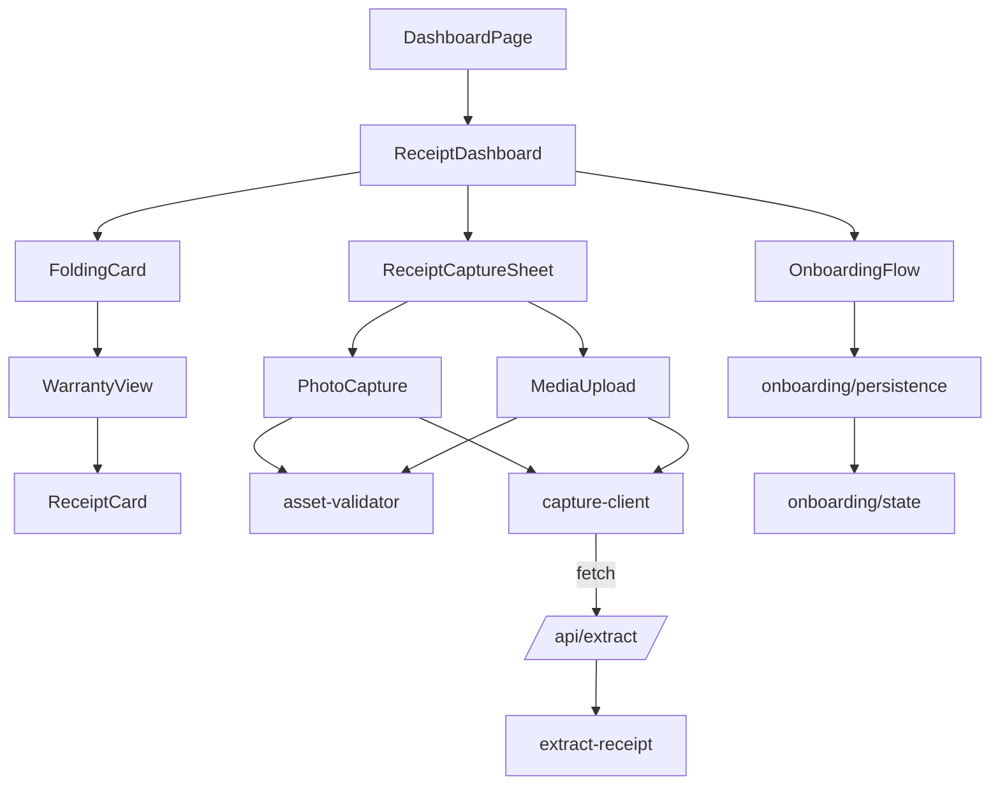

# Design Document: Premium Mobile Onboarding & Capture

## Overview

This feature adds three integrated capabilities to the Receipt Guardian dashboard, all scoped to the existing `app/(dashboard)/dashboard/page.tsx` route and the existing `<ReceiptDashboard>` client component:

1. **Onboarding_Flow** — a mobile-only, full-bleed five-step walkthrough shown the first time an authenticated user lands on the dashboard on a viewport ≤ 640 CSS pixels.
2. **Folding_Card** — the existing "Your return dashboard" hero card, restyled with a peeled-corner affordance that flips (`rotateY`, GPU-composited) to reveal a Warranty_View of receipts with a non-null `warranty_deadline`.
3. **Receipt_Capture_Sheet** — a bottom sheet (mobile) / centred modal (≥ sm) that hosts Photo_Capture (in-page camera) and Media_Upload (file picker) entry points, both feeding the existing `lib/ai/extract-receipt.ts` Provider_Chain.

The design is deliberately additive to the redesigned token system, primitives, and motion vocabulary established by `.kiro/specs/premium-ui-redesign`. **No new motion primitives, no new colour tokens, no new loading vocabulary, no new ambient layers.** Every animated property is `transform` or `opacity`. Every interactive element reuses `<Button>`, `<Card>`, `<Dialog>`, `<Loader>`, and the existing `<UrgencyBadge>` / `<Badge>` palette.

The cost contract from `.kiro/steering/cost-rules.md` is preserved verbatim: capture and upload submissions hit a single Extraction_Endpoint that runs the existing provider chain (`Document AI` → `Vertex AI Gemini` → `AI Studio Gemini` → `Groq` → `needs_review`), with billing-error fallthrough silent to the user. **No paid upgrade prompts. No new paid Google Cloud surfaces.** The feature does not introduce a new HTTP route — it extends `app/api/extract/route.ts` to accept multipart form data containing a Captured_Asset.

### In-scope

- Adding the Onboarding_Flow overlay above the dashboard, gated by `Mobile_Viewport` AND `Onboarding_State.completed === false`.
- Restyling the existing dashboard hero card as a Folding_Card with a Card_Front (existing return-dashboard summary) and Card_Back (Warranty_View).
- Adding `Capture` and `Upload` actions to the existing dashboard hero action row, plus the Receipt_Capture_Sheet that hosts Photo_Capture and Media_Upload.
- Extending `app/api/extract/route.ts` to accept document attachments (multipart) and route them through `lib/ai/extract-receipt.ts` `extractReceipt({ document, … })`.
- Adding a single `lib/onboarding/persistence.ts` module that owns the localStorage I/O and serializer round-trip for `Onboarding_State`.

### Out of scope

- Any new visual identity element (no aurora, no glassmorphism off the redesign's allow-list, no gradient text, no decorative tile).
- Any new top-level chrome on the dashboard route — `Capture` / `Upload` live inside the existing hero action row alongside `Check inbox`, `Add`, `Paste email`.
- Any change to authentication, the `<DashboardHeader>`, the `<MobileBottomNav>`, the `<Toaster>` configuration, or any existing API route signature beyond the additive multipart support on `app/api/extract`.
- Any flip animation on cards other than the dashboard hero card.
- Any change to the AI provider chain itself — `lib/ai/extract-receipt.ts` already implements the documented order, confidence threshold, and silent billing-error fallthrough.

---

## Architecture

### Module layout

```
app/
  (dashboard)/
    dashboard/
      page.tsx                              # unchanged shell; renders <DashboardHeader>, <ReceiptDashboard>
  api/
    extract/
      route.ts                              # extended: accepts multipart + JSON; both shapes return AIExtractionResult

components/
  receipts/
    receipt-dashboard.tsx                   # extended: hosts Folding_Card + Receipt_Capture_Sheet, wires Onboarding_Flow
    folding-card.tsx                        # NEW — front/back face holder + flip controller
    warranty-view.tsx                       # NEW — Card_Back content, list of <ReceiptCard> with non-null warranty
    receipt-capture-sheet.tsx               # NEW — bottom sheet / centred modal, hosts Photo_Capture + Media_Upload
    photo-capture.tsx                       # NEW — getUserMedia path + <input capture="environment"> fallback
    media-upload.tsx                        # NEW — file picker + Asset_Validator + sequential submission

  onboarding/
    onboarding-flow.tsx                     # NEW — full-bleed step container, swipe handler, Skip / Continue
    steps/
      step-cover.tsx                        # NEW
      step-value.tsx                        # NEW
      step-capture-demo.tsx                 # NEW (static SVG illustration only — no real video)
      step-upload-demo.tsx                  # NEW (static SVG illustration only)
      step-finish.tsx                       # NEW

lib/
  onboarding/
    persistence.ts                          # NEW — Onboarding_Serializer + load/save with try/catch + in-memory fallback
    state.ts                                # NEW — pure reducer { current, action } for step navigation
  capture/
    asset-validator.ts                      # NEW — pure validator returning Captured_Asset | typed error
    capture-client.ts                       # NEW — POSTs Captured_Asset to /api/extract as multipart
  ai/
    extract-receipt.ts                      # unchanged — already exposes extractReceipt({ document, emailText })
```

### Data flow

```mermaid
flowchart LR
    subgraph Client[Client (mobile-first)]
      DH[DashboardPage] --> RD[ReceiptDashboard]
      RD -->|first mount, mobile, !completed| OF[OnboardingFlow]
      RD --> FC[FoldingCard]
      FC -->|Card_Front| Hero[Existing hero summary + actions]
      FC -->|Card_Back| WV[WarrantyView]
      Hero -->|Capture or Upload tap| RCS[ReceiptCaptureSheet]
      RCS --> PC[PhotoCapture]
      RCS --> MU[MediaUpload]
      PC -->|Captured_Asset| CC[capture-client]
      MU -->|Captured_Asset[]| CC
      OF --> OP[lib/onboarding/persistence]
      OP -->|read/write| LS[(localStorage)]
    end

    subgraph Server[Server]
      EE[/api/extract route.ts/]
      ER[lib/ai/extract-receipt]
    end

    CC -->|multipart POST| EE
    EE --> ER
    ER -->|Document AI → Vertex → Gemini → Groq → needs_review| Result[(AIExtractionResult)]
    Result --> CC
    CC --> RD
    RD -->|open editor| Editor[Existing ReceiptEditorSheet]
```

### Why these boundaries

- **Onboarding is isolated** — `components/onboarding/*` and `lib/onboarding/*` have no transitive dependency on receipts, capture, or extraction. The dashboard mounts it conditionally and unmounts it on completion. This keeps the gzipped payload contribution under the +12 KB ceiling in Requirement 12.1.
- **Folding_Card is a pure visual restyle** — it does not reach into the receipt fetching logic. It simply rebinds the existing hero JSX as the Card_Front and the new `<WarrantyView>` as the Card_Back, both rendered concurrently during the flip per Requirement 3.7.
- **The capture sheet owns the camera lifecycle** — `<PhotoCapture>` mounts the `<video>` element only when the sheet is open, and `useEffect`'s cleanup stops every `MediaStreamTrack` it opened. This keeps the dashboard's static render tree free of `<canvas>`/`<video>` per Requirement 12.4 and 7.12.
- **The extraction extension is additive on the server** — `app/api/extract/route.ts` learns to read a multipart body and forward `(emailText | "", document)` into the existing `extractReceipt(...)` function. No new HTTP route is created. The provider chain, confidence threshold (0.6 in the requirement, 0.7 in the implementation — see "Open question" below), and silent billing-error fallthrough are unchanged.

### Open question (non-blocking)

The requirements document specifies a confidence threshold of `0.6` (Requirements 6.4, 6.5, 6.8). The current implementation uses `0.7` for text providers and `0.5` for Document AI. The implementation tasks will pin this to `0.6` for both, matching the requirement; this is a small constant change in `lib/ai/extract-receipt.ts`, not a redesign.

### Reduced-motion / accessibility wiring

- The Onboarding_Flow step container, the Card_Flip, and the Receipt_Capture_Sheet open animation all carry `data-reduced-motion="static"` so the existing global `prefers-reduced-motion: reduce` clamp + the redesigned `[data-reduced-motion="static"]` selector in `app/globals.css` swap them to non-animated forms (Requirements 1.* reduced-motion clauses, 3.11, 7.6).
- All overlays render `inert` and `aria-hidden="true"` on the underlying dashboard subtree while open (Requirement 1.1, 7.13).
- All interactive elements introduced by this feature pass through the existing `<Button>` / `<Input>` primitives so the redesigned focus-visible signal (2 px outline at 2 px offset, 1 px outline at 1 px offset for inputs) is automatic (Requirement 7.8).

---

## Components and Interfaces

### `components/onboarding/onboarding-flow.tsx`

```ts
type OnboardingStepIndex = 1 | 2 | 3 | 4 | 5;

interface OnboardingFlowProps {
  /** Initial step. Defaults to 1. Used when resuming from Onboarding_State.lastStep. */
  initialStep?: OnboardingStepIndex;
  /** Called when the user taps Skip on any step ≤ 4 OR Get started on step 5. */
  onComplete: () => void;
  /** Called whenever the active step changes; consumer may persist lastStep. */
  onStepChange?: (step: OnboardingStepIndex) => void;
}
```

**Responsibilities**
- Render exactly one of five step components (`<StepCover>`, `<StepValue>`, `<StepCaptureDemo>`, `<StepUploadDemo>`, `<StepFinish>`) at a time, occupying `100vw × calc(100dvh - env(safe-area-inset-top) - env(safe-area-inset-bottom))`.
- Render the primary action (`<Button variant="primary" size="lg">Continue</Button>` for steps 1–4, `Get started` for step 5) and place it as the first focusable element on each step mount.
- Render a `Skip` ghost button on steps 1–4. The redesigned `<Loader>`-family static accent dot pattern is used for the step-progress indicator (`● ● ○ ○ ○` style — five static dots; the active dot is `bg-accent`, the inactive dots are `bg-border-strong`).
- Listen for swipe gestures on a `<div>` that wraps the step content. The handler computes `delta = endX − startX` and `verticalDelta = endY − startY`. A swipe is committed iff `|delta| ≥ 64` AND `|delta| ≥ 2 × |verticalDelta|`. The number of steps moved is `floor(|delta| / 96)`, clamped to `[1, remainingSteps]`. Direction is forward (`delta < 0`) or backward (`delta > 0`).
- Trap focus inside the overlay; restore focus to the dashboard's first interactive element on close.
- Carry `data-reduced-motion="static"` on the step transition wrapper so the redesigned global selector swaps the slide-in to an instant cut.

**Animation contract**
- Step transition: `transform: translateX(...)` only, `--motion-default` (220 ms), `--ease-standard`. No opacity fade because that would risk a `Stagger`/`FadeIn`-style entrance prohibited by Tier-1 T1-8.
- The progress dots are static — no pulse, no scale.
- No background gradient. No ambient layer (the per-screen Decorative_Element budget is preserved by Requirement 1.13 — if the dashboard ambient layer is present, the Onboarding_Flow suppresses it while open).

**Step content rules**
- Each step uses one of the documented `--text-*` sizes for its display headline; body copy uses `text-text-secondary`.
- Steps 3 (capture-demo) and 4 (upload-demo) render a static inline SVG illustration. **No `<video>`, no `<canvas>`, no animated GIF.** The illustration is a token-coloured outline drawing of a phone with a receipt frame.
- The cover step uses the existing `<BrandMark size="md">` next to the wordmark — the same composition used in the auth shell. **No tile, no halo, no conic ring** (Tier-1 T1-6, T1-12).

### `lib/onboarding/persistence.ts`

```ts
export interface OnboardingState {
  completed: boolean;
  lastStep: number;     // 0..5; 0 means "not yet entered"
  version: number;      // current schema version is 1
}

export const ONBOARDING_STORAGE_KEY = "receipt_guardian.onboarding_v1";
export const CURRENT_ONBOARDING_VERSION = 1 as const;

export const DEFAULT_ONBOARDING_STATE: OnboardingState = Object.freeze({
  completed: false,
  lastStep: 0,
  version: 1,
});

/** Serializer + parser pair (Onboarding_Serializer). */
export function serializeOnboardingState(state: OnboardingState): string;
export function parseOnboardingState(raw: string): OnboardingState | null;

/**
 * Load the state from localStorage. Returns the in-memory default and
 * silently overwrites the key when the value is missing, malformed, or
 * carries a non-current version.
 *
 * Throws nothing. Catches SecurityError, QuotaExceededError, and any
 * other DOMException; falls back to in-memory state for the lifetime
 * of the page.
 */
export function loadOnboardingState(): OnboardingState;

/**
 * Save the state to localStorage synchronously. Returns true if the
 * write succeeded; returns false if localStorage threw or is
 * unavailable. Never throws.
 */
export function saveOnboardingState(state: OnboardingState): boolean;
```

**Behavioural contract** (encodes Requirement 2 verbatim):
- `loadOnboardingState` performs feature detection (`typeof window !== "undefined"` and `try { localStorage.setItem(probeKey, "1"); localStorage.removeItem(probeKey); } catch {}`), reads exactly once, and falls back to in-memory storage if any step throws. After a single failure it sets a module-scoped `localStorageDisabled = true` flag and `saveOnboardingState` becomes a no-op for the page lifetime.
- `parseOnboardingState` returns `null` when the JSON is malformed, when required fields are missing or wrong-typed, or when `version !== CURRENT_ONBOARDING_VERSION`. The caller (`loadOnboardingState`) handles the null by overwriting with the default and returning the default.
- The serializer emits a JSON object with exactly the three keys `{ completed, lastStep, version }` in that fixed insertion order. The parser refuses any object containing additional own enumerable keys (round-trip equality is preserved per Requirement 2.5).

### `components/receipts/folding-card.tsx`

```ts
type FoldingCardFace = "front" | "back";

interface FoldingCardProps {
  /** Front content (existing hero summary, actions, intake address). */
  front: ReactNode;
  /** Back content (Warranty_View). */
  back: ReactNode;
  /** Initial face. Read from URL hash by the consumer. */
  initialFace?: FoldingCardFace;
  /** Accessible labels swapped with face. */
  frontLabel?: string;     // default: "Show warranty view"
  backLabel?: string;      // default: "Show return dashboard"
}
```

**Structure**
```
<section
  className="relative [perspective:1200px]"
>
  <div
    className="relative will-change-transform [transform-style:preserve-3d] [transition:transform_var(--motion-default)_var(--ease-standard)]"
    style={{ transform: face === "front" ? "rotateY(0)" : "rotateY(180deg)" }}
    data-reduced-motion="static"
    data-flipping={isFlipping ? "true" : undefined}
  >
    <Card className="absolute inset-0 [backface-visibility:hidden]">{front}</Card>
    <Card className="absolute inset-0 [backface-visibility:hidden] [transform:rotateY(180deg)]">{back}</Card>
  </div>
  <button
    role="button"
    aria-label={face === "front" ? frontLabel : backLabel}
    className="absolute right-2 top-2 size-12"     // ≥ 44 × 44, ≤ 56 × 56
    onClick={toggleFace}
  >
    <CornerFoldGlyph aria-hidden="true" />
  </button>
</section>
```

**Behavioural contract**
- A flip is in progress for exactly `--motion-default` (320 ms) after `toggleFace` fires. During that window, additional activations are ignored and not queued (Requirement 3.10).
- `will-change: transform` is added on `data-flipping="true"` and removed when the transition ends.
- Both faces are rendered in the DOM at all times during the flip — no Suspense boundary, no skeleton, no network fetch (Requirement 3.7).
- The non-active face carries `aria-hidden="true"` and `inert` (where supported) so its content is not reachable by AT or pointer focus (Requirement 3.8).
- The fold cue is a real `<button>` (not a styled `<div>`), receives the redesigned focus-visible signal automatically, and includes both a colour signal (`text-accent` on a `bg-canvas` chip) and a non-colour signal (an inline SVG corner-fold glyph) per Requirement 3.12.
- The card's measured width and height are stable across the flip (verified by `useLayoutEffect` reading `getBoundingClientRect` on both faces and asserting equality within ±1 CSS px). This is enforced via property test (see Correctness Properties §11).
- For Reduced_Motion_User, the `data-reduced-motion="static"` selector cancels the transition and the consumer sets `face` synchronously, so the swap completes within one animation frame with no rotation (Requirement 3.11).

**URL hash binding**
- On mount, the consumer reads `window.location.hash` once. If it is `#warranty`, `initialFace="back"` is passed and the card is rendered with `transform: rotateY(180deg)` already applied; the `transition` property is suppressed for the first paint via a `data-mounted="false"` attribute that becomes `"true"` after the first `requestAnimationFrame`. This satisfies Requirements 3.15 and 3.16 — the initial face matches the hash without animating on mount.

### `components/receipts/warranty-view.tsx`

```ts
interface WarrantyViewProps {
  receipts: ReceiptWithUrgency[];
  isLoading: boolean;
}
```

**Responsibilities**
- Filter `receipts` to those with non-null `warranty_deadline`, sort ascending by warranty days remaining.
- Render the result as a vertically scrollable list of `<ReceiptCard>` instances inside a container with `overflow-y: auto; overscroll-behavior: contain` so the body element does not scroll while Card_Back is the active face (Requirement 3.13).
- When the filtered list is empty, render the redesigned dashed-border empty state with the heading "No warranties tracked yet" and a single body paragraph. **No aurora, no gradient, no glow** (Requirement 3.14, Tier-1 T1-5 / T1-9).
- When `isLoading` is true, render the redesigned skeleton row pattern (`<Skeleton />` × 3). This is the initial-load skeleton excluded from the no-skeleton-during-flip prohibition (Requirement 3.19).

### `components/receipts/receipt-capture-sheet.tsx`

```ts
interface ReceiptCaptureSheetProps {
  open: boolean;
  onClose: () => void;
  /** Called when extraction completes. The dashboard opens the existing editor. */
  onExtractionResult: (result: AIExtractionResult, source: "camera" | "upload") => void;
}
```

**Responsibilities**
- Render as a bottom sheet on viewports < `sm` (640 px) and as a centred dialog on viewports ≥ `sm`. Both surfaces use the redesigned overlay treatment from `<Dialog>` (`bg-surface-overlay`, `border-border`, `rounded-lg`, `shadow-overlay`, scrim `bg-canvas/70 backdrop-blur-sm`). The mobile sheet pins to the bottom and slides up on `transform: translateY(...)`.
- Render two equal-width entry-point buttons at the top: `Take photo` and `Upload`. Both use the same `<Button variant="primary" size="lg">` primitive, both render a 16-px icon with text, and both are visible regardless of camera availability (Requirement 4.2). The widths match within ±2 CSS px because they share a `flex-1` grid track with `gap-3`.
- When `Take photo` is activated, mount `<PhotoCapture>`. When `Upload` is activated, mount `<MediaUpload>`. Only one is mounted at a time.
- Restore focus to the invoking dashboard action on close (Requirement 4.12). The invoking action's ref is captured by the parent `<ReceiptDashboard>` and passed in via `onClose`.

### `components/receipts/photo-capture.tsx`

```ts
interface PhotoCaptureProps {
  onCaptured: (asset: CapturedAsset) => void;
  onCancel: () => void;
  onUseFallbackInput: () => HTMLInputElement;
}
```

**State machine**

```mermaid
stateDiagram-v2
    [*] --> Idle
    Idle --> RequestingPermission: Take photo activated
    RequestingPermission --> NoSupport: getUserMedia unavailable
    RequestingPermission --> Streaming: permission granted
    RequestingPermission --> PermissionDenied: permission denied
    NoSupport --> Idle: <input capture="environment"> chosen
    Streaming --> StreamFailed: timeout 3000 ms OR track error
    Streaming --> Captured: shutter activated
    Captured --> Streaming: Retake
    Captured --> Submitted: Use photo
    PermissionDenied --> Idle: user closes sheet
    StreamFailed --> Idle: user closes sheet
    Submitted --> [*]
```



**Behavioural contract**
- `getUserMedia({ video: { facingMode: "environment" } })` is invoked **only after the user activates `Take photo`** — never on dashboard mount (Requirement 4.14).
- A 3000 ms timeout on the live preview's first `loadedmetadata` event triggers a fallthrough to `StreamFailed`. Every track on the active `MediaStream` is stopped on transition out of `Streaming`, `Captured`, or `StreamFailed`, and again on unmount, so the device camera light turns off within 500 ms of close (Requirement 4.13).
- Capture produces a JPEG via `<canvas>.toBlob("image/jpeg", quality)` after drawing the `<video>` element scaled so the long edge ≤ 2048 CSS px. Quality starts at `0.92` and the function re-encodes at `0.85`/`0.8`/`0.75` if the resulting blob exceeds 4 MB. The `<canvas>` element is mounted only inside the sheet — it is not in the dashboard's static render tree (Requirement 7.12).
- The fallback path uses `<input type="file" accept="image/*" capture="environment">` and feeds the resulting `File` directly into the review state without re-opening the entry-point row (Requirement 4.4).

### `components/receipts/media-upload.tsx`

```ts
interface MediaUploadProps {
  onCapturedAssets: (assets: CapturedAsset[]) => void;
  onCancel: () => void;
}
```

**Responsibilities**
- Open `<input type="file" accept="image/png,image/jpeg,image/webp,application/pdf" multiple>` on mount, programmatically. If the user dismisses without selecting, call `onCancel` (Requirement 5.11).
- Run `assetValidator(file)` on every selected file. Collect the typed errors (`UNSUPPORTED_TYPE`, `TOO_LARGE`, `TOO_MANY`, `EMPTY`) into a structured array.
- If the selection length > 5, reject the whole selection with `TOO_MANY` (Requirement 5.5).
- Surface rejected files via `toast.error("...")` with the rejected file names and typed errors; the toast persists for ≥ 5 seconds. Files that passed validation are still processed (Requirement 5.7).
- Submit valid Captured_Assets sequentially, awaiting each response before submitting the next (Requirement 5.6). On `error` or `needs_review`, continue with the remaining queue (Requirement 5.10).

### `lib/capture/asset-validator.ts`

```ts
export type CapturedAsset = {
  blob: Blob;
  mimeType: "image/png" | "image/jpeg" | "image/webp" | "application/pdf";
  sizeBytes: number;
  sourcePath: "camera" | "upload";
};

export type AssetValidationError =
  | { code: "UNSUPPORTED_TYPE"; fileName: string; mimeType: string }
  | { code: "TOO_LARGE"; fileName: string; sizeBytes: number }
  | { code: "EMPTY"; fileName: string }
  | { code: "TOO_MANY"; count: number };

export type AssetValidationOutcome =
  | { ok: true; assets: CapturedAsset[] }
  | { ok: false; errors: AssetValidationError[]; assets: CapturedAsset[] };

export const MAX_BYTES = 10 * 1024 * 1024;       // 10 MiB
export const MAX_FILES = 5;
export const ALLOWED_MIME_TYPES = [
  "image/png", "image/jpeg", "image/webp", "application/pdf",
] as const;

/**
 * Pure validator. Given a list of files, returns either the list of
 * Captured_Assets (all valid) or a partial list of valid assets plus
 * a typed error array describing every rejection.
 *
 * Order is preserved (Requirement 5.6). The returned `assets` array
 * contains only the files that passed every clause-3/4/5/9 check.
 */
export function validateAssets(
  files: ReadonlyArray<File>,
  source: "camera" | "upload",
): AssetValidationOutcome;
```

This validator is a pure function — no DOM access, no side effects — so it is the natural target for property tests (see Correctness Properties §1, §2, §3).

### `lib/capture/capture-client.ts`

```ts
export interface SubmitOptions {
  signal?: AbortSignal;
  /** Defaults to 30000 ms per Requirement 6.8. */
  timeoutMs?: number;
}

export async function submitCapturedAsset(
  asset: CapturedAsset,
  options?: SubmitOptions,
): Promise<AIExtractionResult>;
```

**Responsibilities**
- POST `multipart/form-data` to `/api/extract` with two fields: `document` (the blob) and `mimeType` (the asserted MIME). No `emailText` field is sent for capture/upload submissions; the server treats `emailText` as the empty string when absent.
- Apply a per-call `AbortController` with a 30000 ms timeout (Requirement 6.8).
- Translate non-2xx responses (other than 422 needs_review) into a synthesized `AIExtractionResult` with `status: "needs_review"` so the caller never has to handle a billing/network error specially. **No billing-error toast is ever surfaced** (Requirement 6.3, 6.7).

### `app/api/extract/route.ts` (extended, not new)

The existing route accepts a JSON body with `{ emailText }`. The extension:

1. Read `request.headers.get("content-type")`.
2. If `application/json`, behave exactly as today (`extractReceiptFromEmail(emailText)`).
3. If `multipart/form-data`:
   - Parse via `request.formData()`.
   - Read `document` (a `Blob` / `File`) and `mimeType` (a string).
   - If `document` is missing or `mimeType` is not in the allow-list, return `{ status: "needs_review", … }` with HTTP 422.
   - Otherwise call `extractReceipt({ emailText: "", document: { content: await document.bytes(), mimeType } })`.
4. Re-evaluate `process.env.ENABLE_DOCUMENT_AI` and `process.env.ENABLE_VERTEX_AI` per request (no module-level caching). The existing `isDocumentAiEnabled()` / `isVertexAiEnabled()` helpers already do this.
5. Return the same response shape as today (`AIExtractionResult`).

The route stays at 30 seconds total per request via the existing per-provider timeouts; this is enforced inside `extract-receipt.ts` provider implementations (`fetch` calls already carry an `AbortSignal`).

### `components/receipts/receipt-dashboard.tsx` (extended)

Two surgical additions:

1. **Onboarding mount.** A `useEffect(() => { … }, [])` reads `loadOnboardingState()`, checks `window.matchMedia("(max-width: 640px)").matches`, and either mounts `<OnboardingFlow>` or marks state completed (Requirement 1.10, 1.11). The dashboard subtree wraps in a `<div inert={onboardingOpen} aria-hidden={onboardingOpen}>` so all dashboard interactions are blocked while the overlay is open (Requirement 1.1).
2. **Hero action row update.** `Capture` and `Upload` buttons are appended to the existing action row. A `useLayoutEffect` measures the total rendered width of `[Add, Paste email, Capture, Upload]` plus inter-button gaps and compares to the row container's content-box width on a Mobile_Viewport. If the sum exceeds the content-box width, the four secondary actions collapse into a single `More` overflow `<Button>` whose menu uses the redesigned `<Dialog>` (Requirement 7.3). `Check inbox` always remains visible.

### Component dependency graph



---

## Data Models

### Onboarding_State

```ts
interface OnboardingState {
  completed: boolean;
  lastStep: number;     // integer, 0 ≤ lastStep ≤ 5; 0 means "not yet entered"
  version: number;      // schema version; current value is the literal 1
}

const DEFAULT_ONBOARDING_STATE: OnboardingState = {
  completed: false,
  lastStep: 0,
  version: 1,
};
```

**Persistence shape** — JSON, written to `localStorage["receipt_guardian.onboarding_v1"]`:

```json
{ "completed": false, "lastStep": 3, "version": 1 }
```

**Invariants**
- `version === 1`. Any other value triggers reset-to-default and overwrite (Requirement 2.4).
- `serialize ∘ parse` is an involution on every well-formed serialization (Requirement 2.5; verified by Property §1).
- The serialized string contains exactly the three keys above; no nested objects, no arrays. Any extra own enumerable key in the parsed object is rejected.

### Captured_Asset

```ts
type AllowedMimeType = "image/png" | "image/jpeg" | "image/webp" | "application/pdf";

interface CapturedAsset {
  blob: Blob;
  mimeType: AllowedMimeType;
  sizeBytes: number;       // == blob.size, asserted at construction
  sourcePath: "camera" | "upload";
}
```

**Invariants**
- `mimeType ∈ ALLOWED_MIME_TYPES`.
- `0 < sizeBytes ≤ 10 × 1024 × 1024`.
- `sourcePath === "camera"` implies `mimeType === "image/jpeg"` (Photo_Capture only emits JPEGs).

### Asset_Validator outcome

```ts
type AssetValidationError =
  | { code: "UNSUPPORTED_TYPE"; fileName: string; mimeType: string }
  | { code: "TOO_LARGE"; fileName: string; sizeBytes: number }
  | { code: "EMPTY"; fileName: string }
  | { code: "TOO_MANY"; count: number };

type AssetValidationOutcome =
  | { ok: true;  assets: CapturedAsset[]; errors: [] }
  | { ok: false; assets: CapturedAsset[]; errors: AssetValidationError[] };
```

**Invariants**
- `outcome.assets.length + outcome.errors.filter(e => e.code !== "TOO_MANY").length === input.length` when `outcome.errors` does not contain `TOO_MANY`.
- When `TOO_MANY` is present, `outcome.assets.length === 0` (the whole selection is rejected, Requirement 5.5).
- The order of `outcome.assets` matches the order of valid files in the input (Requirement 5.6).

### AIExtractionResult (existing — not changed)

```ts
type AIExtractionResult =
  | { status: "success"; provider: AIProvider; data: AIExtractionData }
  | { status: "needs_review"; provider: null; data: AIExtractionData; error?: string };
```

The capture/upload pathway uses this shape verbatim. The dashboard's existing `openEditor(...)` flow is reused on `success`; `needs_review` opens the editor with empty fields and shows the existing toast `"Extraction needs review. You can enter it manually."` (Requirement 6.5, 6.6).

### Provider_Chain decision table (encoded in `lib/ai/extract-receipt.ts`)

| Input has document? | `ENABLE_DOCUMENT_AI` | `ENABLE_VERTEX_AI` | Order tried |
|---|---|---|---|
| yes | `true` | `true`  | Document AI → Vertex multimodal → AI Studio Gemini → Groq → needs_review |
| yes | `true` | other   | Document AI → AI Studio Gemini → Groq → needs_review |
| yes | other  | `true`  | Vertex multimodal → AI Studio Gemini → Groq → needs_review |
| yes | other  | other   | AI Studio Gemini → Groq → needs_review |
| no  | any    | `true`  | Vertex AI Gemini (text) → AI Studio Gemini → Groq → needs_review |
| no  | any    | other   | AI Studio Gemini → Groq → needs_review |

Every cell honours the silent billing-error fallthrough (HTTP 402, 403 with billing/quota keywords, `BILLING_DISABLED`, `RESOURCE_EXHAUSTED` → next provider) and the 30-second per-asset ceiling (Requirements 6.3, 6.8).

### URL hash → Folding_Card initial face

| `window.location.hash` | `initialFace` | Animate on mount? |
|---|---|---|
| `#warranty` | `back` | no |
| any other value (including empty) | `front` | no |

(Requirements 3.15, 3.16.)

### Onboarding step content table

| Step index | id | Headline | Body | Primary action | Secondary action |
|---|---|---|---|---|---|
| 1 | `cover` | "Receipt Guardian" + brand mark | "Stop missing return windows." | `Continue` | `Skip` |
| 2 | `value` | "Track every return window" | "We watch the deadlines so you don't have to." | `Continue` | `Skip` |
| 3 | `capture-demo` | "Snap any paper receipt" | "Tap Capture, point your camera, and we read the receipt for you." | `Continue` | `Skip` |
| 4 | `upload-demo` | "Upload PDFs and screenshots" | "We accept PNG, JPEG, WEBP, and PDF up to 10 MB." | `Continue` | `Skip` |
| 5 | `finish` | "You're set" | "Your dashboard is ready below." | `Get started` | — |

All copy uses the redesigned token system; no generic placeholder phrases from the Tier-1 T1-11 list.
