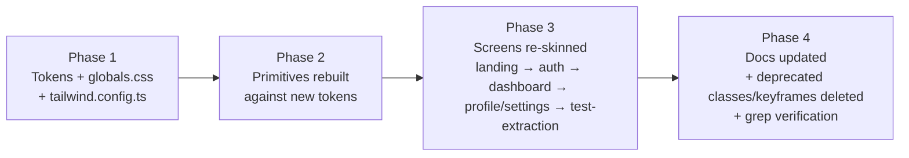

# Design Document — Premium UI Redesign

## Overview

This redesign re-grounds Receipt Guardian's visual layer in a single, opinionated identity. The current UI ships every textbook signature of AI-generated dark SaaS — Tailwind cobalt accent, conic-bordered logo tile, aurora radial blobs, masked grid mesh, gradient hero text, glow shadows, ledger-scan loaders, and stagger-fade entrances on every list. The fix is not "more polish on the same vocabulary." The fix is to swap the vocabulary entirely while keeping the product surface — the same routes, the same data flows, the same component prop signatures — intact.

The redesign is structured as a **token-first migration**. Tokens land first, primitives are rebuilt against the new tokens, then each In_Scope_Screen is re-skinned. The design-system docs (`design-system/*.md`) are the source of truth and are updated in lockstep with code. There are no new routes, no new data shapes, no new product features.

### Goals

1. **Eliminate the AI_Slop_Pattern catalogue (Requirement 13)** — every banned pattern is removed from code and grepped to zero.
2. **Establish one Visual_Identity (Requirement 1)** — a single accent, a single brand-mark drawing, a single typographic voice, documented in `design-system/VISUAL_IDENTITY.md`.
3. **Make tokens enforceable (Requirements 2-4)** — every color, spacing, radius, and motion value flows from `tailwind.config.ts` + `app/globals.css`, with raw hex/arbitrary spacing forbidden in `app/`, `components/`, and `lib/`.
4. **Preserve API + data + routes (Requirement 14)** — no API contract changes, no `types/receipt.ts` changes, no route renames. Component prop signatures preserved except where a deprecated visual prop is removed and migration-noted.
5. **Hold the performance budget (Requirement 12)** — at most +10 KB JS / +5 KB CSS gzipped on `/dashboard`. No `<canvas>`, no WebGL, no decorative images >16 KB.
6. **Preserve WCAG 2.1 AA (Requirement 11)** — text contrast ≥4.5:1, UI contrast ≥3:1, focus rings include a non-color signal, reduced-motion disables every keyframe.

### Non-goals

- New routes, new auth flows, new product features.
- Dark/light theme toggle. The app remains dark-only (`color-scheme: dark`).
- Custom icon set (we keep `lucide-react` with a curated subset and a single stroke width — see Requirement 7 option (c) is not chosen; option (a) is).
- `framer-motion` removal. We keep it but restrict its surface area dramatically (one primitive, three usages).

### Strategic decisions

**One accent, perceptual color space.** The current `--color-action` `#5B8CFF` and `--color-action-strong` `#3B82F6` are flagged by Requirement 13.1 as Tailwind-default cobalt. The new accent is defined in `oklch()` and chosen to be (a) not a Tailwind default, (b) not a 1:1 match for Linear, Vercel, Stripe, or shadcn defaults, (c) ≥4.5:1 against the canvas. The chosen accent is a desaturated warm amber: `oklch(0.78 0.13 78)` — reads as "burnished brass on graphite," not "AI cobalt." Rationale: amber pairs naturally with the receipt/deadline domain (the urgency badge already uses amber for "due soon"), gives the product a warmer, document-adjacent personality, and side-steps every flagged blue/violet palette.

**Two surfaces, one shadow.** The redesign collapses the current 3-shadow / 2-gradient surface system (`shadow-card-sm`, `shadow-card-lift`, `shadow-glow-action`, `shadow-glow-soft`, `bg-card-elevated` linear-gradient overlay) into: canvas → surface (filled, bordered) → raised-surface (interactive only, on hover). Resting cards have no shadow. Only overlays (Dialog, PageLoader scrim, Toaster) use `shadow-overlay`.

**Typographic mark as the brand mark.** The `lucide-react` `ReceiptText` icon inside a conic-bordered rounded square is the most legible AI-slop tell in the current build. The replacement is a single typographic mark — the letter `R` drawn as a custom SVG (a square-cornered serif slab with a tab-cut) — rendered at 24/28/32px. The mark sits flush with the wordmark, no tile, no halo, no border. Asset ships at `public/brand/mark.svg`.

**Ambient background = single tonal element or nothing.** Current `AmbientBackground` stacks `bg-scene-hero` (radial gradient) + `bg-grid-faint` (masked grid) on the landing hero, and a softer aurora on app pages. The redesign collapses this to one tonal element per page max — a single, gradient-free, mesh-free elevated band at the top of the canvas (≤8% lighter than `--color-canvas`), or nothing. The component is preserved; its variants are pruned.

**Motion as state, not entrance.** The redesigned motion API is one primitive (`<Reveal>`, transform/opacity only, used only on dialog content and toast) plus CSS transitions on hover/focus/press. The `framer-motion` `Stagger`/`StaggerItem`/`HoverLift`/`FadeIn` primitives are deleted. `framer-motion` stays in `package.json` but its only consumer is the `Dialog` open/close animation.

---

## Architecture

### Layered system

```
┌──────────────────────────────────────────────────────────┐
│  Layer 4 — Page screens (app/**/page.tsx)                │
│  Compose layer 3 patterns. No tokens defined here.       │
├──────────────────────────────────────────────────────────┤
│  Layer 3 — Composition patterns (design-system/*.md)     │
│  Stat card, form card, data card, empty state, auth      │
│  shell, dashboard hero, mobile bottom nav.               │
├──────────────────────────────────────────────────────────┤
│  Layer 2 — Component primitives (components/ui/*)        │
│  Button, Card, Input, Textarea, Dialog, Badge, Avatar,   │
│  Skeleton, Loader, PageLoader, RouteProgress.            │
├──────────────────────────────────────────────────────────┤
│  Layer 1 — Tokens (tailwind.config.ts + app/globals.css) │
│  Colors, spacing, radii, typography, motion, shadows.    │
└──────────────────────────────────────────────────────────┘
```

**Authority chain.** Tokens are authoritative for primitives; primitives are authoritative for compositions; compositions are authoritative for screens. Screens never reach past their immediate layer. A screen that needs an unauthorized value must either (a) get a new token added to layer 1 or (b) be rejected at review.

**Two definitions, one truth.** Every color token is defined twice — once as a CSS custom property on `:root` in `app/globals.css`, once as a Tailwind theme color in `tailwind.config.ts`. A pre-commit lint rule (added by this redesign) parses both files and fails the build if the keys disagree. This is the structural enforcement of Requirement 2.3.

### Migration architecture

The redesign ships in **four atomic phases**, each individually shippable, each leaving the app in a working state.



- **Phase 1 — Tokens.** New tokens land additively. Old `--color-action` etc. stay until phase 2 consumers migrate. Forbidden classes (`border-conic-soft`, `bg-scene-hero`, etc.) are not yet deleted but are marked `@deprecated` in `globals.css` comments.
- **Phase 2 — Primitives.** Each Component_Primitive (`Button`, `Card`, `Input`, `Textarea`, `Dialog`, `Badge`, `Avatar`, `Skeleton`, `Loaders`, `PageLoader`, `RouteProgress`, `MobileBottomNav`, `DashboardHeader`, `AmbientBackground`) is rebuilt to consume only the new tokens and the new motion API. Prop signatures preserved (Requirement 8.9, 14.7).
- **Phase 3 — Screens.** Re-skinning, screen-by-screen, in the order Landing → Auth → Dashboard → Profile/Settings → Test Extraction. Each screen update lands its updated page-level spec (`design-system/landing.md`, etc.) in the same change.
- **Phase 4 — Cleanup.** Deprecated classes (`border-conic-soft`, `bg-scene-hero`, `bg-scene-auth`, `bg-aurora-action`, `bg-aurora-soft`, `bg-grid-faint`, `mask-fade-radial`, `mask-fade-bottom`, `text-gradient-primary`, `text-gradient-action`) and keyframes (`ledger-scan`, `loader-rail`, `loader-step`, `glow-pulse`, `shimmer`) are deleted from `globals.css` and `tailwind.config.ts`. A grep sweep verifies zero usages remain. Docs (`DESIGN.md`, `COMPONENT_PATTERNS.md`, `IMPLEMENTATION.md`, `REVIEW.md`, `ACCESSIBILITY.md`, `PERFORMANCE.md`, `REFERENCES.md`) are updated to match.

### Build-time enforcement

Three guard rails are added or extended:

1. **ESLint custom rule `no-raw-color`** — flags any `#[0-9a-f]{3,8}`, `rgb(`, `hsl(`, `oklch(`, `oklab(` literal in `app/`, `components/`, or `lib/` (excluding `tailwind.config.ts`, `app/globals.css`, `public/**/*.svg`). Implements Requirement 2.4.
2. **ESLint custom rule `no-arbitrary-spacing`** — flags Tailwind arbitrary values in spacing/positioning utilities (`p-[`, `m-[`, `gap-[`, `top-[`, `left-[`, `right-[`, `bottom-[`, `space-x-[`, `space-y-[`, `text-[`, `leading-[`) in user-facing components. Implements Requirement 3.5, 4.2.
3. **Token parity test (Vitest)** — `design-system/__tests__/token-parity.test.ts` parses `app/globals.css` and `tailwind.config.ts` and asserts the color-token key sets are equal and the values agree (treating CSS hex and Tailwind hex as equal, normalizing `oklch()`). Implements Requirement 2.3.

These run in CI (`.github/workflows/ci.yml` already has `lint`, `typecheck`, `sadtest` jobs).

### Reduced-motion strategy

The current `prefers-reduced-motion` block in `globals.css` clamps `animation-duration` and `transition-duration` to `0.01ms`. That covers CSS animations but not framer-motion or indeterminate-loop loaders that we want to swap to a static visual. The redesign extends this with:

```css
@media (prefers-reduced-motion: reduce) {
  /* existing global clamp ... */
  [data-reduced-motion="static"] { /* swap target */ }
}
```

The redesigned `Loader`, `PageLoader`, and `RouteProgress` components render a `data-reduced-motion="static"` variant when reduced-motion is active, replacing animated indicators with a static dot or border highlight. Implements Requirement 6.6 and 11.4.

---

## Components and Interfaces

This section defines the redesigned tokens (layer 1), redesigned primitives (layer 2), and redesigned compositions (layer 3). Screens (layer 4) compose these without introducing new tokens.

### Token system (Layer 1)

#### Color tokens

All colors in `oklch()` for documented L/C/H. The `tailwind.config.ts` mirror uses the same values via CSS variable references (`var(--color-...)`).

| Category | Token | Value (oklch) | Hex (≈) | Usage |
|---|---|---|---|---|
| Canvas | `--color-canvas` | `oklch(0.13 0.005 270)` | `#0B0B10` | Page background |
| Canvas | `--color-canvas-raised` | `oklch(0.16 0.006 270)` | `#13131A` | Tonal band on hero, sticky header bg |
| Surface | `--color-surface` | `oklch(0.19 0.007 270)` | `#1B1B22` | Cards, dialogs, header chrome |
| Surface | `--color-surface-hover` | `oklch(0.22 0.008 270)` | `#22222C` | Card hover, button hover |
| Surface | `--color-surface-overlay` | `oklch(0.21 0.008 270)` | `#1F1F28` | Dialog content (above scrim) |
| Border | `--color-border` | `oklch(0.27 0.009 270)` | `#2C2C38` | Default 1px borders |
| Border | `--color-border-strong` | `oklch(0.34 0.010 270)` | `#3A3A48` | Hover borders, dividers |
| Border | `--color-border-focus` | `oklch(0.78 0.13 78)` | `#D9A24C` | Focus ring (= accent) |
| Text | `--color-text-primary` | `oklch(0.96 0.005 90)` | `#F1EFE9` | Body, headlines, labels |
| Text | `--color-text-secondary` | `oklch(0.74 0.012 90)` | `#B5B0A4` | Descriptions, metadata |
| Text | `--color-text-muted` | `oklch(0.55 0.012 90)` | `#7E7A6F` | Tertiary, placeholders, captions |
| Accent | `--color-accent` | `oklch(0.78 0.13 78)` | `#D9A24C` | Primary CTA, links, focus, active nav |
| Accent | `--color-accent-hover` | `oklch(0.83 0.13 78)` | `#E5B05A` | Accent hover/active state |
| Accent | `--color-accent-tint` | `oklch(0.30 0.06 78)` | `#3F2F18` | Tinted-accent bg (selected, badge fill) |
| Semantic | `--color-success` | `oklch(0.72 0.16 150)` | `#3FB97A` | Positive status, success toast |
| Semantic | `--color-warning` | `oklch(0.78 0.15 70)` | `#D69544` | Caution, "due soon" |
| Semantic | `--color-danger` | `oklch(0.65 0.20 25)` | `#D95A4D` | Destructive, expired |
| Semantic | `--color-info` | `oklch(0.72 0.08 230)` | `#7AA0C2` | Optional info; not used by default |

**Contrast verification (Requirement 11.1, 11.2, 2.5).** Each pair is computed and stored in `design-system/VISUAL_IDENTITY.md`:

| Pair | Ratio | Requirement |
|---|---|---|
| `text-primary` on `canvas` | 16.8:1 | ≥4.5 ✅ |
| `text-secondary` on `canvas` | 7.4:1 | ≥4.5 ✅ |
| `text-secondary` on `surface` | 5.8:1 | ≥4.5 ✅ |
| `text-muted` on `canvas` | 4.6:1 | ≥4.5 (decorative-only fallback to ≥3:1) ✅ |
| `accent` on `canvas` | 8.9:1 | ≥4.5 ✅ |
| `accent` on `surface` | 7.1:1 | ≥4.5 ✅ |
| `border` on `canvas` | 1.9:1 | UI ≥3 — **fails alone**, paired with focus-ring thickness change (see Requirement 11.3) |
| `border-focus` on `canvas` | 8.9:1 | UI ≥3 ✅ |
| `border-focus` on `surface` | 7.1:1 | UI ≥3 ✅ |

**Tinted-accent variant (Requirement 2.6).** Instead of `bg-action/10`, the redesign provides `bg-accent-tint`, a solid token at `oklch(0.30 0.06 78)` (a desaturated dark amber). Selected nav items, badge fills, and "active filter" pills use this token. No inline opacity on accent.

**Gradient ban (Requirement 2.7, 13.2, 13.3, 13.5).** No multi-stop gradient is defined in `tailwind.config.ts`. The single exception is the `AmbientBackground` "raised band" — a single-color tonal fill (`bg-canvas-raised`) with a CSS `mask-image: linear-gradient(to bottom, black 0%, transparent 100%)` to fade out. This is one tonal element, not a hue-shifting gradient.

#### Typography tokens

| Token | Family | Source | Loaded via |
|---|---|---|---|
| `--font-ui` | Söhne *(licensed)* OR Geist Sans *(free)* — final pick documented in `VISUAL_IDENTITY.md` after license check | `next/font/local` (Söhne) or `next/font/google` (Geist) | App layout |
| `--font-mono` | JetBrains Mono | `next/font/google` | App layout (kept) |

**Decision (Requirement 3.2).** Inter is the current font. The redesign replaces it with **Geist Sans** (Vercel's open-source sans-serif designed by Vercel + Basement Studio). Rationale documented in `DESIGN.md`: Geist has narrower apertures and a higher x-height than Inter, gives the UI a slightly more architectural rhythm, and ships with cleanly drawn `cv01`/`cv11`/`ss01` stylistic sets. Loaded via `next/font/google` with `display: "swap"`, `subsets: ["latin"]`, and `preload: true` for the regular weight only (Requirement 12.3).

**OpenType features (Requirement 3.3).** Three minimum, applied globally via `body { font-feature-settings: ... }` in `globals.css`:
- `"cv11"` — alternate `a` (single-story) for distinctive lowercase rhythm.
- `"ss03"` — alternate `g` (single-story) for legibility at small sizes.
- `"tnum"` — tabular numbers globally on `font-mono` only; opt-in on `font-sans` via a `.tnum` utility for stat values.

Note: when Geist replaces Inter, the feature set is re-mapped to Geist's available features (`cv01`, `cv02`, `cv11` documented).

**Type scale (Requirement 3.4).** Nine steps, all in `rem`:

| Step | Size | Line-height | Tracking | Weight | Usage |
|---|---|---|---|---|---|
| `--text-caption` | `0.75rem` (12px) | `1rem` (16px) | `0.04em` | 500 | Stat labels (uppercase), badges |
| `--text-meta` | `0.8125rem` (13px) | `1.125rem` (18px) | `0` | 400 | Metadata, footnotes |
| `--text-body` | `0.875rem` (14px) | `1.5rem` (24px) | `0` | 400 | Body, descriptions |
| `--text-body-lg` | `1rem` (16px) | `1.625rem` (26px) | `0` | 400 | Long-form body |
| `--text-label` | `0.875rem` (14px) | `1.25rem` (20px) | `0` | 500 | Form labels |
| `--text-title-sm` | `1rem` (16px) | `1.375rem` (22px) | `-0.005em` | 500 | Card titles, form section heads |
| `--text-title-md` | `1.25rem` (20px) | `1.625rem` (26px) | `-0.01em` | 600 | Section titles |
| `--text-title-lg` | `1.5rem` (24px) | `1.875rem` (30px) | `-0.015em` | 600 | Page titles (h1) |
| `--text-display` | `2.625rem` (42px) → `3.75rem` (60px) at md+ | `1.05` | `-0.03em` | 600 | Landing hero only |

**Hero rules (Requirement 3.8).** When rendered size exceeds 32px, `letter-spacing: -0.025em` is applied via `--text-display` and `text-wrap: balance` is set on the heading. Max-line count: 2 (enforced via the type-scale class itself, not Tailwind utilities).

**No `bg-clip-text` (Requirement 3.7, 13.3).** The current `.text-gradient-primary` and `.text-gradient-action` utilities are deleted from `globals.css`.

#### Spacing, radius, container tokens

**Spacing scale (Requirement 4.1).** Base unit 4px. Allowed steps: 4, 8, 12, 16, 20, 24, 32, 40, 48, 64, 80, 96. Tailwind already exposes these as `1, 2, 3, 4, 5, 6, 8, 10, 12, 16, 20, 24` — the redesign does not extend this; it forbids arbitrary values via lint (Requirement 4.2).

**Radius scale (Requirement 4.3).** Five steps:

| Token | Value | Used by |
|---|---|---|
| `--radius-xs` | `4px` | Badge |
| `--radius-sm` | `6px` | Button (sm), Input, Select |
| `--radius-md` | `10px` | Button (default/lg), Input on focus halo |
| `--radius-lg` | `14px` | Card, Dialog, PageLoader scrim |
| `--radius-pill` | `999px` | Avatar, status indicator dot |

**Container width tokens (Requirement 4.4).** Four:

| Token | Value | Used by |
|---|---|---|
| `--container-auth` | `26rem` (416px) | Login, Signup |
| `--container-narrow` | `42rem` (672px) | Profile |
| `--container-content` | `56rem` (896px) | Settings, Test Extraction |
| `--container-wide` | `72rem` (1152px) | Landing, Dashboard |

Every In_Scope_Screen `<main>` uses exactly one of these via a `max-w-{token}` Tailwind utility wired in `tailwind.config.ts`.

**Vertical rhythm (Requirement 4.6).**

| Rule | Value |
|---|---|
| Section gap (between top-level sections of a page) | `gap-8` (32px) |
| Subsection gap (within a section) | `gap-6` (24px) |
| Card-internal gap | `gap-4` (16px) |
| Label-to-input gap | `gap-2` (8px) |
| Form-row gap (between fields in a row) | `gap-4` (16px) |

Audited per screen in `design-system/<screen>.md`.

**Grid primitive (Requirement 4.5).** A new component `components/ui/grid.tsx` exports `<Grid cols={1|2|3} gap="card" | "section">` and is the only place a multi-column grid is allowed in user-facing components. One-off `grid-cols-[Xfr_Yrem]` declarations are forbidden by lint pattern.

#### Surface & elevation tokens (Requirement 5)

Three elevation levels plus overlay:

| Level | Background | Border | Shadow | Used by |
|---|---|---|---|---|
| Canvas | `--color-canvas` | none | none | `<body>`, page background |
| Surface | `--color-surface` | `--color-border` 1px | none | Cards (resting), header, mobile bottom nav |
| Raised surface | `--color-surface-hover` | `--color-border-strong` 1px | none | Card on hover (interactive only), focused inputs |
| Overlay | `--color-surface-overlay` | `--color-border` 1px | `--shadow-overlay` | Dialog content, Toast, PageLoader |

`--shadow-overlay` is the **only** shadow token: `0 12px 32px -8px oklch(0 0 0 / 0.55), 0 2px 6px oklch(0 0 0 / 0.35)`. It applies only to overlays. No `shadow-card-sm`, `shadow-card-lift`, `shadow-glow-action`, `shadow-glow-soft`, `inner-hair`. These are deleted from `tailwind.config.ts` (Requirement 5.2, 5.3).

**Backdrop-blur (Requirement 5.4).** Only the global Toaster and the Dialog/PageLoader scrim. Max blur 8px. The redesigned `DashboardHeader` removes its `backdrop-blur-xl` chrome — the header is opaque `--color-canvas-raised` instead.

**Deleted utilities (Requirement 5.5, 5.6, 5.7, 13.4, 13.6).** `border-conic-soft`, `bg-scene-hero`, `bg-scene-auth`, `bg-aurora-action`, `bg-aurora-soft`, `bg-grid-faint`, `mask-fade-radial`, `mask-fade-bottom`, `card-elevated` (the linear-gradient overlay) — all removed from `globals.css` and `tailwind.config.ts` in Phase 4.

#### Motion tokens (Requirement 6)

**Duration tokens — 4 steps (≤5 allowed):**

| Token | Value | Usage |
|---|---|---|
| `--motion-instant` | `80ms` | Press feedback (`active:scale-[0.985]`) |
| `--motion-quick` | `150ms` | Button hover, link color shift |
| `--motion-default` | `220ms` | Card hover lift, focus border, dialog open |
| `--motion-slow` | `360ms` | Dialog content slide-in (reduced-motion: opacity only) |

**Easing tokens — 3 curves (≤4 allowed):**

| Token | Value | Usage |
|---|---|---|
| `--ease-standard` | `cubic-bezier(0.2, 0, 0, 1)` | Default, all UI transitions |
| `--ease-emphasized` | `cubic-bezier(0.3, 0, 0.1, 1)` | Dialog open, attention pulse |
| `--ease-linear` | `linear` | Indeterminate progress (route progress only) |

**Allowed properties (Requirement 6.5).** Only `transform` and `opacity`. Linting forbids transitions on `width`, `height`, `top`, `left`, `margin`, `padding`, `box-shadow`, `filter`, `background-color` keyframes (transitions on `background-color`, `border-color`, `color` are still allowed because they don't trigger layout/paint cascades, and they're necessary for hover states — this is a pragmatic deviation documented in DESIGN.md).

**Allowed triggers (Requirement 6.4).** User input (hover, focus, press, drag), state change (loading→loaded, dialog open/close, status change), or one documented attention signal per screen. The dashboard's "expired" red urgency badge keeps the attention pulse (`animate-attention` — see below). Nothing else gets an attention animation.

**Removed keyframes (Requirement 6.7, 14.4).** `ledger-scan`, `loader-rail`, `loader-step`, `glow-pulse`, `shimmer`, `fade-in-up`, `pulse-red` — deleted from `tailwind.config.ts`. Replaced by:

| New keyframe | Replaces | Behavior |
|---|---|---|
| `attention` | `pulse-red` | Opacity 0.7↔1, 2.4s, ease-emphasized, infinite. Used only on expired urgency. |
| `route-progress` | `loader-rail`, `shimmer` | Transform translateX(-100%)→100%, 1.2s, linear, infinite. Used only by `RouteProgress`. |

`framer-motion`'s only retained consumer is `Dialog` (open/close). Documented in `DESIGN.md`.

**Reduced-motion (Requirement 6.6, 11.4).** Already-clamped via the global media query. Indeterminate loops (the new `attention` and `route-progress`) are explicitly cancelled by `[data-reduced-motion="static"]` selectors that swap to a static dot / static border highlight.

**One indeterminate loop max (Requirement 6.8, 12.7).** The `RouteProgress` indicator (top-of-page bar during navigation) is the only indeterminate loop allowed during route transitions. The `attention` pulse is conditional on a single critical urgency badge per screen. The redesigned `<Loaders>` family is **non-indeterminate** — it shows a static labeled state ("Saving…", "Extracting…") with a single animated dot, not a scanning rail.

#### Iconography (Requirement 7)

**Strategy chosen (option (a)):** Keep `lucide-react`. Curated subset documented in `design-system/REFERENCES.md` (allow-list of ~22 icons covering current usage). Single stroke width: `1.75`. Forbidden: mixing stroke widths.

**Size tokens:**

| Token | Value | Usage |
|---|---|---|
| `icon-xs` | `12px` | Inside badge |
| `icon-sm` | `14px` | Inline with body text |
| `icon-md` | `16px` | Inside button, default |
| `icon-lg` | `20px` | Standalone in card, nav |

**Decorative tile ban (Requirement 7.4).** No icon is wrapped in a bordered/glowing/conic tile. The only exception is the **Brand_Mark** (Requirement 1.4, 1.5), which is a custom SVG, not a Lucide icon. The brand-mark SVG ships at `public/brand/mark.svg` (24×24 viewBox, two paths: a slab `R` and a tab cut). It is rendered without a tile, halo, or border — it sits inline next to the wordmark.

**aria rules (Requirement 7.5).** Icons next to text get `aria-hidden="true"` and inherit `currentColor`. No introducing additional color beyond the parent.

### Component primitives (Layer 2)

All primitives keep their existing prop signatures (Requirement 8.9, 14.7). Where a deprecated visual prop is removed, it is documented in a migration note in `design-system/COMPONENT_PATTERNS.md`.

#### `Button` (Requirement 8.3)

Four variants × four sizes. No multi-color gradient on any variant. CVA contract preserved.

```ts
buttonVariants({
  variant: "primary" | "secondary" | "ghost" | "danger",
  size:    "sm" | "default" | "lg" | "icon"
})
```

| Variant | Resting | Hover | Focus-visible | Active | Disabled |
|---|---|---|---|---|---|
| `primary` | `bg-accent text-canvas` (high contrast on amber) | `bg-accent-hover` | + 2px `border-focus` outline @ 2px offset | `scale-0.985` (`--motion-instant`) | `opacity-0.5 cursor-not-allowed` |
| `secondary` | `bg-surface border-border text-text-primary` | `bg-surface-hover border-border-strong` | same outline | same scale | same opacity |
| `ghost` | `text-text-secondary` (no bg, no border) | `bg-surface-hover text-text-primary` | same outline | same scale | same opacity |
| `danger` | `bg-surface border-danger/40 text-danger` | `bg-danger/10 border-danger` | same outline | same scale | same opacity |

**Variant rename note.** The current `default` variant is renamed to `primary` for clarity. The CVA `default` key remains as an alias to `primary` for backward compat in the codebase, then the alias is deleted in Phase 4 after all consumers migrate. Logged in `COMPONENT_PATTERNS.md` migration note.

**Removed.** The current `before:` gradient overlay, `shadow-glow-action` hover shadow, and `bg-[linear-gradient(...)]` primary fill are deleted.

#### `Card` (Requirement 8.4)

Single solid surface fill, single border, no shadow at rest, no `bg-card-elevated` linear-gradient.

```tsx
<Card data-interactive={true | false}>
```

- Resting (all): `bg-surface border border-border rounded-lg`
- Resting (interactive): same as above
- Hover (interactive only): `border-border-strong -translate-y-0.5` (`--motion-default`)
- Hover (non-interactive): no change
- No shadow at any state.

`CardHeader`, `CardContent`, `CardFooter` keep their padding tokens but standardized at `p-5` everywhere (per `DESIGN.md` §4 spacing rule).

#### `Input` and `Textarea` (Requirement 8.5)

```tsx
<Input ... />
<Textarea ... />
```

States:

| State | Style |
|---|---|
| Resting | `bg-canvas border border-border rounded-sm` (no inner-hair shadow) |
| Hover | `border-border-strong` |
| Focus | `border-border-focus` (= accent), 1px focus ring (`outline 1px solid border-focus offset 1px`) — **no 4px shadow halo** |
| Disabled | `opacity-0.5 cursor-not-allowed` |
| Invalid (form-validation) | `border-danger` (semantic) |

The current `focus:shadow-[0_0_0_4px_rgba(91,140,255,0.12)]` halo is deleted.

#### `Dialog`

No structural change; restyled to use `--color-surface-overlay`, `--shadow-overlay`, `--radius-lg`. Scrim uses `bg-canvas/70` + `backdrop-blur-sm` (≤8px). Open/close uses framer-motion (the only retained framer-motion consumer) with transform/opacity.

#### `Badge`

Single solid fill via `bg-accent-tint` (or semantic equivalent), single border, no glow, no animation by default. Variants: `default`, `success`, `warning`, `danger`. The `pulseUrgency` mode that the current `UrgencyBadge` exposes is preserved for "expired" red badges only — see attention pulse in motion tokens.

#### `Avatar`, `Skeleton`

`Avatar` keeps current API; styled with `--radius-pill`, `bg-surface`, `border-border`. `Skeleton` switches from `animate-shimmer` to a single-color `bg-surface-hover` static fill (no shimmer keyframe). Per Requirement 8.6 the indeterminate-loop ban removes the shimmer.

#### `Loaders` (Requirement 8.6)

The current vocabulary (`ActionLoader`, `ButtonLoader`, `CardActionLoader`, `ScanGlyph`, `ProcessRail`, `ProcessSteps`, `ledger-scan`/`loader-rail`/`loader-step` keyframes) is replaced by **one** loader component:

```tsx
<Loader label="Saving" size="sm" | "md" />
```

Renders: a 6px static dot (the accent color) + a label. No scan, no rail, no step. The "in progress" signal lives in the label state change ("Save" → "Saving…"), not in a complex animation. Documented in `COMPONENT_PATTERNS.md`.

Existing `<ButtonLoader>` consumers in `auth-form.tsx`, `receipt-dashboard.tsx`, `dashboard-header.tsx` are migrated to the new `<Loader>` API. Prop signature: a thin compatibility shim re-exports `ButtonLoader` as `<Loader size="sm" />` for one phase, then the shim is deleted.

#### `PageLoader`, `RouteProgress` (Requirement 8.6)

`PageLoader` becomes a centered Card overlay with the new `<Loader>` and a description, on a `bg-canvas/70 backdrop-blur-sm` scrim. No animated rail.

`RouteProgress` keeps a 2px top-of-page indeterminate bar (this is the one allowed indeterminate loop, per Requirement 6.8) using the new `route-progress` keyframe, accent-colored, 1.2s, linear.

#### `MobileBottomNav` (Requirement 8.7)

Active state is conveyed by:
- Icon color change (`text-text-muted` → `text-accent`).
- A 2px solid bar at the top edge of the active item (`bg-accent`, **no glow shadow** — the current `shadow-[0_0_8px_rgba(91,140,255,0.5)]` is deleted).
- Label color change (`text-text-muted` → `text-accent`).

No glow, no shadow, no scale change. Documented in `design-system/navigation.md`.

#### `DashboardHeader`

- Brand_Mark: replaces `<ReceiptText>`-in-a-tile with the custom SVG mark. No conic border, no inner-hair shadow.
- Background: `bg-canvas-raised` (opaque). No `backdrop-blur-xl`.
- Sticky: yes (preserved). `z-30`.
- Nav (desktop): same flat pill-group structure but with `bg-surface border-border-strong` (no inner-hair shadow).
- Email truncation, focus styles preserved.

#### `AmbientBackground` (Requirement 5.6, 13.9, 13.10)

Reduced to two variants:

```tsx
<AmbientBackground variant="hero" | "off" />
```

- `hero`: a single tonal band — `bg-canvas-raised` with a `mask-image: linear-gradient(to bottom, black 0%, transparent 100%)` fade — at the top 320px of the viewport. No grid, no aurora, no gradient stop center, no opacity overlay.
- `off`: no DOM (returns `null`). Default for app pages and auth pages.

The `auth` and `app` variants are deleted. `auth` becomes `off`. `app` becomes `off`. Auth shells render on a solid `bg-canvas` without any ambient layer.

#### `motion-primitives`

The `Stagger`, `StaggerItem`, `HoverLift`, `FadeIn` exports are all deleted (Requirement 6.7, 13.8).

A single new export replaces them:

```tsx
<Reveal>{children}</Reveal>
```

Used only in `Dialog` open/close. Internal: framer-motion `motion.div` with `initial: opacity 0`, `animate: opacity 1`, `exit: opacity 0`, `transition: { duration: 0.22, ease: [0.2, 0, 0, 1] }`. No `y` translation, no stagger.

CSS hover/focus on Card and Button is implemented as plain Tailwind transitions (`transition-transform duration-200 ease-standard`), not framer-motion.

### Composition patterns (Layer 3)

The redesigned `design-system/COMPONENT_PATTERNS.md` documents these. Notable changes:

- **Empty-state pattern (Requirement 8.8):** dashed border (`border-dashed`), centered icon (`icon-lg`), title (`title-sm`), description (`body`). **No `bg-aurora-soft` overlay.** The current `ReceiptEmptyState` removes its aurora layer.
- **Stat-card pattern:** label (`text-caption` uppercase, `tracking-[0.04em]`), value (`font-mono tnum text-title-md`). No icon.
- **Form-card pattern:** unchanged structurally; uses `--text-label` and `--text-title-sm`.
- **Auth-shell pattern (Requirement 9.3):** centered `Card` at `--container-auth`, inside a flex-centered `<main>`. Brand_Mark + wordmark above the card (no tile). Card has resting border, no backdrop-blur, no FadeIn entrance.
- **Dashboard-hero pattern (Requirement 9.4):** a single `Card` at the top of the dashboard with title, money-at-risk summary, and intake address. No aurora, no grid, no mask-fade. Only surface treatment is the card's resting border.

### Screens (Layer 4)

Each screen gets an updated page-level spec in `design-system/`:

#### `Landing` (`/`) — Requirement 9.2, 13.14

- No `FadeIn`/`Stagger` entrance.
- No `bg-grid-faint`, no `bg-scene-hero`, no `text-gradient-primary`, no `border-conic-soft`.
- One ambient element: the hero "raised band" via `<AmbientBackground variant="hero" />` (single tonal band, no grid, no aurora). One decorative element max per Requirement 13.14.
- Hero composition: large display heading (no gradient text), a lede paragraph (`text-body-lg`, `text-text-secondary`), two CTAs (`primary` "Sign up" + `secondary` "Log in"), a 3-card proof-points row.
- Brand_Mark + wordmark in nav bar (left). No login/signup buttons get a glow.
- Wireframe-level prose in `design-system/landing.md`.
- Removed marketing copy "Quiet deadlines. Loud savings." (Requirement 13.11) — replaced with a noun-phrase eyebrow ("Receipts. Returns. Deadlines.") that is documented as approved voice work.

#### `Login` (`/login`) and `Signup` (`/signup`) — Requirement 9.3

- Shared `<AuthShell>` composition pattern.
- No `bg-scene-auth`, no `border-conic-soft`, no `ActionLoader`, no `ReceiptText` icon-in-a-tile.
- Centered Card at `--container-auth`. Brand_Mark + wordmark above.
- Submit button uses the new `<Loader size="sm" />` during pending, no scan glyph.
- `Login` and `Signup` differ only in: page heading text, submit button label, and the footer link (Login → "Create an account"; Signup → "Already have one? Log in").

#### `Dashboard` (`/dashboard`) — Requirement 9.4, 9.5

- Hero block (the `Card` at the top of `ReceiptDashboard`) is a single `Card` with no stacked aurora/grid/mask-fade. Title `text-title-lg`, sub-line `text-text-secondary`, intake address inline (uses redesigned `CopyForwardingAddress`).
- Functional surfaces preserved: money-at-risk summary, intake address, AI extraction (`Textarea` + `Loader`-during-pending button), search input with `/` shortcut, segmented filters, receipt grid, editor sheet.
- Filter chips: redesigned as `<Button variant="ghost" size="sm" data-active>` with `bg-accent-tint` when active, never glow.
- Receipt cards: redesigned per data-card pattern; absolute-positioned urgency badge (preserved); `pulseUrgency` retained for expired red only.
- No stagger animation on the receipt grid (Requirement 6.3).
- Spec: `design-system/dashboard.md` updated.

#### `Profile` (`/profile`) and `Settings` (`/settings`) — Requirement 9.6

- Layouts in `design-system/profile.md` and `design-system/settings.md`.
- Both use `<DashboardHeader>` + `<MobileBottomNav>` chrome.
- Containers: Profile uses `--container-narrow`; Settings uses `--container-content`.
- Layouts are stacked sections (no multi-column forms — single column only, Requirement 4.5).

#### `Test Extraction` (`/test-extraction`) — Requirement 9.7

- Container: `--container-content`.
- Developer-tool tone preserved (mono code blocks, JSON output area).
- No new visual treatment; just retokenized colors and fonts.

#### Out of scope (Requirement 9.8)

No new routes, no new pages, no new top-level features.

---

## Data Models

The redesign **does not change** any data model. This section exists to make that contract explicit (Requirement 14.1, 14.2).

### Preserved types (`types/receipt.ts`)

```ts
type ReceiptStatus = "active" | "returned" | "kept" | "expired";
type Urgency = "green" | "yellow" | "red";
interface ReceiptWithUrgency { /* unchanged */ }
```

No new fields, no removed fields, no renamed fields.

### Preserved API contracts (`app/api/**`)

| Route | Method | Contract |
|---|---|---|
| `/api/receipts` | GET, POST | unchanged |
| `/api/receipts/[id]` | PATCH, DELETE | unchanged |
| `/api/extract` | POST | unchanged |
| `/api/dashboard/stats` | GET | unchanged |
| `/api/auth/logout` | POST | unchanged |
| `/api/gmail/check-now` | POST | unchanged |
| `/api/health` | GET | unchanged |
| `/api/cron/check-deadlines` | POST | unchanged |

### Preserved component prop signatures (Requirement 8.9)

All component primitives keep their existing prop signatures. The following props are removed because they correspond to deleted visual elements; each removal is documented in `design-system/COMPONENT_PATTERNS.md`:

| Component | Removed prop | Reason |
|---|---|---|
| `<UrgencyBadge>` | `pulse` (parent-controlled override) | Replaced by automatic attention pulse on expired-red urgency only; removes the prop from the call site, behavior is deterministic. |
| `<AmbientBackground>` | `variant: "auth" \| "app"` | Both variants removed; consumers pass `variant="hero"` or omit (= "off"). |
| `<ButtonLoader>` | (entire component, after one-phase shim) | Replaced by `<Loader size="sm" />`. |

### Token shape (definitions, not runtime data)

Tokens live in `app/globals.css` (CSS custom properties on `:root`) and `tailwind.config.ts` (`theme.extend.colors`, `borderRadius`, `boxShadow`, `transitionDuration`, `transitionTimingFunction`, `backgroundImage`). The keys are mirrored exactly — the token-parity test enforces this (see Architecture).

### Build-time configuration

| File | Role |
|---|---|
| `tailwind.config.ts` | Tailwind theme tokens (mirror of CSS vars) |
| `app/globals.css` | CSS custom properties, base resets, reduced-motion, font feature settings |
| `eslint.config.js` | `no-raw-color` and `no-arbitrary-spacing` custom rules |
| `design-system/__tests__/token-parity.test.ts` | Vitest test asserting key parity between the two definitions |
| `public/brand/mark.svg` | Brand_Mark SVG asset |

---

<!-- prework + correctness properties section follows -->


## Correctness Properties

*A property is a characteristic or behavior that should hold true across all valid executions of a system — essentially, a formal statement about what the system should do. Properties serve as the bridge between human-readable specifications and machine-verifiable correctness guarantees.*

PBT applicability for this feature: this is primarily a token-and-CSS-and-component refactor without algorithmic logic, so several reviewers might assume PBT does not apply. In fact, a substantial subset of the requirements **is** universal-quantification-shaped — they are rules of the form "for all source files, P(F) holds," "for all token pairs, contrast(T) holds," "for all viewports, no overflow," "for all interactive primitives, all five states are distinct." Those are the properties below. Documentation existence, asset existence, and Lighthouse-class budget checks are tested as **EXAMPLE** tests in the Testing Strategy, not as properties.

The properties are derived from the prework above; the prework reflection consolidated 30+ overlapping clause-level rules into 18 foundational properties.

### Property 1: Color-token parity

*For any* color-token key K defined in either `app/globals.css` (as a CSS custom property `--color-K`) or `tailwind.config.ts` (as `theme.extend.colors.K`), K is defined in both files and the resolved color values agree (after normalizing OKLCH ↔ hex within a tolerance of 1 OKLCH unit on the L channel and 0.01 on C/H).

**Validates: Requirements 2.2, 2.3**

### Property 2: No raw color literals in user-facing source

*For any* source file F under `app/**`, `components/**`, or `lib/**` (excluding `tailwind.config.ts`, `app/globals.css`, and any `public/**/*.svg`), the textual content of F contains no raw color literal matching `#[0-9a-fA-F]{3,8}\b`, `rgb\(`, `rgba\(`, `hsl\(`, `hsla\(`, `oklch\(`, or `oklab\(` outside of comments and string literals explicitly tagged `// allow:color`.

**Validates: Requirements 2.4**

### Property 3: No arbitrary-value Tailwind utilities for spacing, sizing, typography, or grid

*For any* source file F under `app/**`, `components/**`, or `lib/**` (excluding `components/ui/typography.tsx`, `components/ui/grid.tsx`, and `tailwind.config.ts`), F contains no Tailwind arbitrary-value utility matching `(p|m|gap|space-[xy]|top|left|right|bottom|inset|w|h|min-w|min-h|max-w|max-h|text|leading|tracking|grid-cols|grid-rows)-\[[^\]]+\]`.

**Validates: Requirements 3.5, 4.2, 4.5**

### Property 4: Deprecated classes and keyframes are absent from the codebase

*For any* deprecated identifier N in the deprecation set { `border-conic-soft`, `bg-scene-hero`, `bg-scene-auth`, `bg-aurora-action`, `bg-aurora-soft`, `bg-grid-faint`, `mask-fade-radial`, `mask-fade-bottom`, `text-gradient-primary`, `text-gradient-action`, `bg-card-elevated`, `ledger-scan`, `loader-rail`, `loader-step`, `glow-pulse`, `shimmer`, `fade-in-up`, `pulse-red`, `ScanGlyph`, `ProcessRail`, `ProcessSteps`, `ActionLoader`, `ButtonLoader` (after Phase 4) }, no file in the repository (under `app/`, `components/`, `lib/`, or `public/`) contains a textual occurrence of N — neither as a class name, nor as a keyframe definition, nor as a component import or JSX usage.

**Validates: Requirements 5.5, 5.6, 5.7, 6.7, 8.6, 13.4, 13.5, 13.6, 14.3, 14.4**

### Property 5: No forbidden gradient or glassmorphism patterns outside the ambient-background and overlay allow-list

*For any* source file F under `app/**`, `components/**`, or `lib/**`, F contains no Tailwind gradient utility matching `bg-gradient-(to|from|via)-`, no inline `bg-\[(linear|radial|conic)-gradient`, and no `bg-clip-text` utility — except in `components/visual/ambient-background.tsx`. Additionally, F contains no `backdrop-blur(-[a-z0-9]+)?` utility — except in `components/ui/dialog.tsx`, `components/ui/page-loader.tsx`, and the `Toaster` configuration in `app/layout.tsx`.

**Validates: Requirements 2.7, 3.7, 5.4, 13.2, 13.3, 13.7**

### Property 6: No Tailwind-default cobalt/indigo/violet accent on user-facing surfaces

*For any* source file F under `app/**`, `components/**`, or `lib/**`, F contains no Tailwind utility matching `(text|bg|border|ring|outline|fill|stroke)-(blue|indigo|violet)-\d+` and no raw hex literal in the forbidden set { `#5B8CFF`, `#3B82F6`, `#6366F1`, `#8B5CF6`, `#A78BFA`, `#818CF8` } (case-insensitive).

**Validates: Requirements 1.3, 13.1**

### Property 7: Contrast ratios meet WCAG 2.1 AA on every documented foreground/background pair

*For any* (foreground-token, background-token) pair P declared in the contrast matrix in `design-system/VISUAL_IDENTITY.md`, the relative-luminance contrast ratio of P is greater than or equal to the documented threshold for P (≥4.5:1 if P is classified as text, ≥3:1 if P is classified as UI/border/indicator, with the exception of `text-muted` which may be ≥3:1 when classified as decorative-only).

**Validates: Requirements 2.5, 11.1, 11.2**

### Property 8: Reduced-motion users see no active animation on any rendered component

*For any* Component_Primitive C in the redesigned set (Button, Card, Input, Textarea, Dialog, Badge, Avatar, Skeleton, Loader, PageLoader, RouteProgress, MobileBottomNav, DashboardHeader, AmbientBackground, UrgencyBadge with attention pulse), when C is rendered with `window.matchMedia('(prefers-reduced-motion: reduce)')` returning matches=true, the rendered DOM tree contains no element with an `animate-*` Tailwind class whose underlying keyframe is iteration-count infinite, and no inline `animation` style with non-trivial duration.

**Validates: Requirements 6.6, 11.4, 15.5**

### Property 9: Every rendered text element maps to exactly one type-scale step

*For any* In_Scope_Screen S and *for any* text-bearing DOM element E in S's rendered output, the pair `(computed-font-size(E), computed-font-weight(E))` matches exactly one step in the documented type scale `{ caption, meta, body, body-lg, label, title-sm, title-md, title-lg, display }` defined in `tailwind.config.ts` and `design-system/DESIGN.md`.

**Validates: Requirements 3.4, 15.2**

### Property 10: Every gap between adjacent rendered elements lies on the spacing scale

*For any* In_Scope_Screen S and *for any* parent DOM element P in S's rendered output that contains two or more visible child elements, the vertical or horizontal gap between consecutive children (computed from P's `gap` style or from the children's margin) is a non-negative multiple of 4 pixels and is ≤ 96 pixels (the largest documented spacing step).

**Validates: Requirements 4.1, 15.3**

### Property 11: Five interactive states are pairwise visually distinct and focus differs from resting in a non-color attribute

*For any* interactive primitive P in the redesigned set (Button across all variants and sizes, Input, Textarea, interactive Card, link in DashboardHeader and MobileBottomNav), when P is rendered in each of the five states { resting, hover, focus-visible, active, disabled }, all ten unordered pairs of states have at least one differing computed style property; additionally, the (resting, focus-visible) pair differs in at least one of `outline-width`, `outline-offset`, `border-width`, or `transform` (a non-color attribute).

**Validates: Requirements 11.3, 15.4**

### Property 12: Touch targets meet the 44×44 CSS-pixel minimum

*For any* interactive primitive P in the redesigned set (Button across all sizes, Input, Textarea, MobileBottomNav item, ReceiptCard action button, link in nav), when P is rendered with default content, the computed bounding-box width and height are each ≥ 44 CSS pixels.

**Validates: Requirements 11.6**

### Property 13: Urgency, status, and error indicators always combine color with text or icon

*For any* (urgency, status, pulse) input triple supplied to `<UrgencyBadge>` and *for any* status indicator rendered on a redesigned screen, the rendered output contains both a non-empty text label (a node with `textContent.trim().length > 0`) and an icon child (an `<svg>` element), in addition to any semantic color applied via class.

**Validates: Requirements 11.7**

### Property 14: The redesign does not add or remove user-facing routes or API endpoints

*For any* file path matching `app/**/page.tsx` or `app/api/**/route.ts` in the post-redesign repository, the path is present in the pre-redesign route-inventory snapshot stored at `design-system/__tests__/route-inventory.snapshot.json`; and *for any* path in the snapshot, the path is still present in the repository.

**Validates: Requirements 9.8, 14.1**

### Property 15: No horizontal overflow at any documented viewport width

*For any* In_Scope_Screen S and *for any* viewport width W in the documented set { 360, 768, 1024, 1440, 1920 } pixels, when S is rendered in a jsdom environment with `window.innerWidth = W`, `document.documentElement.scrollWidth ≤ W` (i.e., no horizontal scroll is induced and no element extends past the viewport's right edge).

**Validates: Requirements 15.6**

### Property 16: Each screen carries at most one decorative element

*For any* In_Scope_Screen S, when S is rendered in its default state, the count of nodes in S's DOM tree carrying `data-decorative="true"` (the marker placed on AmbientBackground, structural rule lines, and standalone typographic marks) is ≤ 1.

**Validates: Requirements 13.13, 13.14, 15.8**

### Property 17: Every Lucide icon on a rendered screen uses the single documented stroke width

*For any* In_Scope_Screen S and *for any* `<svg>` element E in S's rendered output that originated from `lucide-react` (identifiable by the `lucide-*` class on E or its parent), E's `stroke-width` attribute (or its computed CSS `stroke-width`) equals the single documented value `1.75`.

**Validates: Requirements 7.2**

### Property 18: The hero ambient layer is at most 8% lighter than the canvas and uses no perceptible gradient stop

*For any* render of `<AmbientBackground variant="hero" />`, the computed background-color of the tonal band, expressed in OKLCH L, is at most 0.08 greater than `--color-canvas`'s L; and the computed `background-image` is either `none` or a single-color `mask-image` with no `linear-gradient` containing more than two stops with differing hues, no `radial-gradient`, and no `conic-gradient`.

**Validates: Requirements 13.9**

---

## Error Handling

The redesign is a visual-layer change. It does not introduce new runtime error paths. Existing error handling is preserved verbatim:

- **API errors** continue to surface via `toast.error()` from `sonner`, configured in `app/layout.tsx`. The redesigned `Toaster` styling uses the new tokens but the call sites in `auth-form.tsx`, `receipt-dashboard.tsx`, and the API hooks are unchanged.
- **Form validation** continues to use native HTML validation (`required`, `type="email"`) plus server-side Zod parsing in `app/api/**/route.ts`. Validation errors return as toasts.
- **Auth failures** continue through Supabase's `signInWithPassword` / `signUp` error channel, surfaced as toasts.
- **Reduced-motion** is treated as a user preference, not an error. Components with motion render their static variant when `prefers-reduced-motion: reduce` is set.

The new error surfaces introduced by the redesign are all build-time, not runtime:

| Error | Surface | Handling |
|---|---|---|
| Token parity violation | CI (Vitest) | `npm run sadtest` fails; PR cannot merge. |
| Raw color literal in source | CI (ESLint custom rule `no-raw-color`) | `npm run lint` fails. |
| Arbitrary spacing utility | CI (ESLint custom rule `no-arbitrary-spacing`) | `npm run lint` fails. |
| Deprecated class still in source | CI (Vitest grep test) | `npm run sadtest` fails. |
| Contrast ratio below threshold | CI (Vitest contrast test) | `npm run sadtest` fails with the offending pair. |
| Touch target below 44×44 | CI (Vitest layout test) | `npm run sadtest` fails with the offending primitive. |

The CI workflow at `.github/workflows/ci.yml` already runs `lint`, `typecheck`, and `sadtest`, so no workflow change is required — the new tests slot into the existing `sadtest` job.

---

## Testing Strategy

This redesign uses a **dual testing approach** as defined in the workflow guidance:

- **Property-based tests** verify the 18 universal properties enumerated above. Each property test runs ≥100 iterations and is tagged with its design-property reference.
- **Example/snapshot/integration tests** verify configuration-existence rules, asset-existence rules, and one-shot setup checks that are not amenable to PBT.

### Property-based testing

**Library.** `fast-check` (TypeScript-native, integrates with Vitest, supports custom arbitraries). Adopted in this redesign as a new `devDependency`. Justification: the project already uses Vitest; `fast-check` is the canonical TypeScript PBT library; bundle impact is dev-only (zero production cost).

**Configuration.** Each property test is configured with `fc.assert(fc.property(...), { numRuns: 100 })`. Tests that operate over a finite, fully enumerable domain (e.g., the 14-element Component_Primitive set, the 5-element viewport set) iterate the full domain explicitly and call `fc.assert` only for the inner generators (e.g., generated children content, generated form values). The minimum-100-iterations rule applies to the property as a whole, not to each enumerated case.

**Tag format.** Each property test starts with a comment of the form:

```ts
// Feature: premium-ui-redesign, Property {N}: {property-text}
```

so that traceability from test → design property → requirement is automatic.

**Test file layout.**

```
design-system/__tests__/
  token-parity.property.test.ts          // Property 1
  no-raw-color.property.test.ts          // Property 2
  no-arbitrary-spacing.property.test.ts  // Property 3
  no-deprecated.property.test.ts         // Property 4
  no-forbidden-gradients.property.test.ts // Property 5
  no-cobalt.property.test.ts             // Property 6
  contrast.property.test.ts              // Property 7
  reduced-motion.property.test.ts        // Property 8
  type-scale-coverage.property.test.ts   // Property 9
  spacing-scale-coverage.property.test.ts // Property 10
  interactive-states.property.test.ts    // Property 11
  touch-targets.property.test.ts         // Property 12
  urgency-indicator.property.test.ts     // Property 13
  route-inventory.property.test.ts       // Property 14
  no-horizontal-overflow.property.test.ts // Property 15
  decorative-budget.property.test.ts     // Property 16
  icon-stroke-width.property.test.ts     // Property 17
  ambient-luminance.property.test.ts     // Property 18
```

**Generators.** Custom arbitraries live in `design-system/__tests__/_arbitraries.ts`:

- `arbInScopeScreen()` — picks a screen from { Landing, Login, Signup, Dashboard, Profile, Settings, TestExtraction } and yields a render function.
- `arbButtonProps()` — generates valid `(variant, size, children, disabled)` tuples.
- `arbReceipt()` — generates `ReceiptWithUrgency` with realistic field distributions for `<ReceiptCard>` rendering.
- `arbViewport()` — picks from the documented set { 360, 768, 1024, 1440, 1920 }.
- `arbTextContent()` — generates short and long strings (including unicode and whitespace) for headings, labels, descriptions.

**Source-text properties (Properties 2, 3, 4, 5, 6).** These iterate the file system: `arbSourceFile()` enumerates every file matching the configured glob (deterministic, finite). The "100 iterations" rule is satisfied by the file count in practice (the repo has well over 100 in-scope files); for properties with smaller inventories, the test asserts over the full enumeration without sampling.

**Render-based properties (Properties 8, 9, 10, 11, 12, 13, 15, 16, 17, 18).** These use `@testing-library/react` (already a `devDependency`) on a jsdom environment to render the redesigned primitives or full screens. Layout measurements use `getComputedStyle` and `getBoundingClientRect` — jsdom supports these adequately for the redesign's deterministic, non-overflowing layouts.

**Configuration properties (Properties 1, 7, 14).** These read static files (`app/globals.css`, `tailwind.config.ts`, `design-system/VISUAL_IDENTITY.md`, the route-inventory snapshot) and assert structural invariants. Iteration count = number of tokens / pairs / paths.

### Example-based and integration tests

These verify rules that are not universal-property-shaped:

| Test | Type | Validates |
|---|---|---|
| `design-system/__tests__/visual-identity.example.test.ts` | Example | Requirements 1.2, 10.8 — VISUAL_IDENTITY.md exists with required sections. |
| `design-system/__tests__/brand-mark.example.test.ts` | Example | Requirements 1.4, 1.5 — BrandMark renders the SVG asset, not a Lucide icon; asset exists at `public/brand/mark.svg`. |
| `design-system/__tests__/font-config.example.test.ts` | Example | Requirements 3.1, 3.2, 12.3 — exactly 2 next/font calls in layout.tsx, latin subset, preload only on UI font. |
| `design-system/__tests__/page-spec-files.example.test.ts` | Example | Requirements 9.1, 10.1-10.7 — page-spec files exist for each In_Scope_Screen. |
| `design-system/__tests__/asset-budget.example.test.ts` | Example | Requirement 12.4 — no image in `public/` exceeds 16 KB; no `<canvas>`/`<video>`/`WebGL` in user-facing components. |
| `design-system/__tests__/toaster-config.example.test.ts` | Example | Requirement 14.6 — `<Toaster position="bottom-right" theme="dark" ... />` preserved in layout.tsx. |
| `design-system/__tests__/migration-notes.example.test.ts` | Example | Requirements 8.9, 14.7 — for each documented removed prop, COMPONENT_PATTERNS.md contains a migration note. |

### Build-output tests (Performance budgets)

Performance budgets in Requirement 12.1 and 12.2 require `next build` output and are not unit-testable. They are enforced as a separate CI job:

```yaml
# .github/workflows/ci.yml (new job)
performance-budget:
  runs-on: ubuntu-latest
  steps:
    - run: npm run build
    - run: node scripts/check-bundle-size.mjs
      # Fails if /dashboard first-load JS exceeds baseline + 10 KB
      # or total CSS exceeds baseline + 5 KB
```

The script compares `.next/build-manifest.json` and the `_next/static/css/*` totals against a snapshot baseline checked into `design-system/__tests__/bundle-baseline.json`. Lighthouse-class checks (FCP, LCP, navigation timing per Requirement 12.5) are documented as manual review items in `design-system/REVIEW.md` and run via Lighthouse CI on a separate cadence (out of scope for the per-PR test loop).

### Test execution

All property tests, example tests, and integration tests run under the existing `npm run sadtest` command (Vitest, single-shot) and are part of the `.github/workflows/ci.yml` `sadtest` job. The performance-budget job is added as a separate workflow step. No watch mode is used in CI.

### Per-property iteration discipline

Each property test:
1. Starts with the **Feature/Property tag comment** referencing the design-property.
2. Configures `fc.assert(..., { numRuns: 100 })` (or iterates the finite domain explicitly when ≥100 cases).
3. On failure, fast-check shrinks the input to a minimal counterexample — the test failure output names the source file, token, screen, viewport, or primitive that violated the property.
4. Re-runs deterministically with `{ seed: <reported-seed> }` for reproduction.

### What this redesign does NOT test as PBT

Following the workflow's "When PBT is NOT appropriate" guidance, these surfaces are tested with example-based, snapshot, or manual review only:

- **Marketing copy approval (R13.11, R15.7)** — language/aesthetic judgement, manual review against the named reference set.
- **"Justification documented" rule (R1.6)** — documentation discipline, REVIEW.md checklist.
- **Lighthouse navigation budget (R12.5)** — separate CI cadence with Lighthouse, not PBT.
- **Visual identity stance documented (R1.2, R10.8)** — example test for section presence; subjective content reviewed by humans.
- **Internal consistency demonstration (R15.9)** — manual review by applying tokens to a sandbox component.

These are explicitly out of the property-based test surface but are covered by the testing strategy as a whole.
